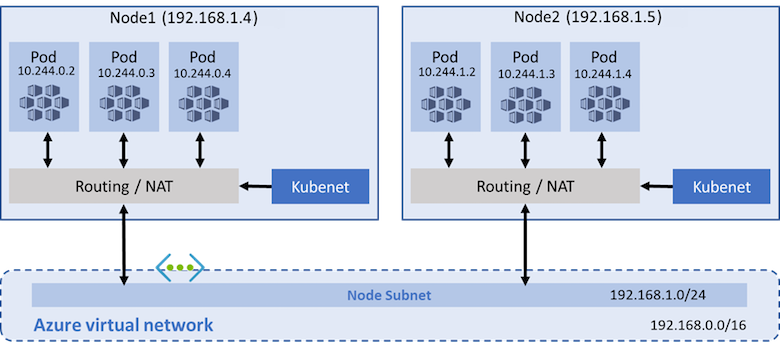
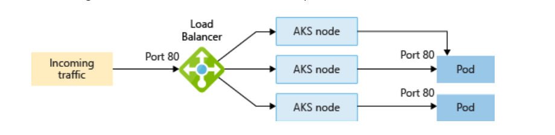

# Lab Module 3: Azure Kubernetes Service (AKS) Networking


## Training Overview
> **Estimated Duration:** 90 minutes  
> **Prerequisites:** Basic knowledge of Kubernetes, Azure CLI, and container networking concepts  
> **Learning Path:** Azure Kubernetes Service Fundamentals

## Table of Contents
- [Exercise 1: Kubenet Networking with Custom Subnet](#exercise-kubenet-with-byo-subnet)
- [Exercise 2: Azure CNI Overlay Networking](#azure-cni-overlay-with-byo-subnet)
- [Exercise 3: Load Balancer Services (Internal & External)](#create-a-service-with-azure-loadbalancer)
- [Exercise 4: Application Routing (Managed Ingress)](#create-a-cluster-with-web-application-routing)

## Key Learning Objectives
By the end of this lab module, you will be able to:
- Compare and contrast kubenet vs Azure CNI networking models
- Implement custom VNet integration with AKS clusters
- Configure internal and external load balancers for applications
- Set up managed ingress controllers for HTTP/HTTPS routing
- Understand the role of route tables, subnets, and NSGs in AKS networking
- Apply network security policies and traffic management

## Important Notes for Participants
> ⚠️ **Resource Management:** Review the node resource group (MC_*) throughout the lab to understand how AKS automatically manages dependent Azure resources  
> 📝 **Best Practice:** Keep track of created resources for cleanup at the end of the lab  
> 🔍 **Troubleshooting:** Use `kubectl describe` and Azure portal for detailed resource inspection
## Exercise 1: Kubenet Networking with Custom Subnet {#exercise-kubenet-with-byo-subnet}

### Background and Context
Kubenet is the basic networking plugin for Kubernetes, also known as the "legacy" networking model. In this exercise, you'll create an AKS cluster using kubenet with a custom Azure Virtual Network (VNet).



### Key Concepts to Understand
- **Kubenet Model:** Uses Linux bridges and simple routing
- **IP Address Management:** Pods receive IPs from a separate CIDR block (pod-cidr)
- **Route Tables:** Azure automatically manages routes for pod communication
- **Node IPs:** Nodes get IPs directly from the subnet
- **Network Isolation:** Limited compared to Azure CNI

### Learning Outcomes
Upon completion of this exercise, you will understand:
- How kubenet networking operates in AKS environments
- IP address allocation strategies for pods and nodes
- The critical role of Azure route tables in pod-to-pod communication
- Host networking concepts and their practical applications
- CIDR reusability patterns across multiple clusters

### Step 1: Create Infrastructure and AKS Cluster

#### 1.1 Create Resource Group and Virtual Network
```bash
# Create resource group in East US 2
az group create --name myResourceGroup3 --location eastus2

# Create VNet with custom address space
az network vnet create \
  --resource-group myResourceGroup3 \
  --name myAKSVnet \
  --address-prefixes 192.168.0.0/16 \
  --subnet-name myAKSSubnet \
  --subnet-prefix 192.168.1.0/24 \
  --location eastus2

# Store subnet ID for cluster creation
SUBNET_ID=$(az network vnet subnet show \
  --resource-group myResourceGroup3 \
  --vnet-name myAKSVnet \
  --name myAKSSubnet \
  --query id -o tsv)
```

#### 1.2 Create AKS Cluster with Kubenet
```bash
# Create AKS cluster with kubenet networking
az aks create \
  --resource-group myResourceGroup3 \
  --name myAKSCluster3 \
  --network-plugin kubenet \
  --service-cidr 10.0.0.0/16 \
  --dns-service-ip 10.0.0.10 \
  --pod-cidr 10.244.0.0/16 \
  --docker-bridge-address 172.17.0.1/16 \
  --vnet-subnet-id $SUBNET_ID \
  --node-count 2 \
  --node-vm-size Standard_D2s_v3 \
  --location eastus2

# Get cluster credentials
az aks get-credentials -n myakscluster3 -g myresourcegroup3

# Verify cluster information
kubectl cluster-info
```

### Step 2: Network Analysis and Pod Deployment

#### 2.1 Inspect Node IP Addresses
```bash
kubectl get nodes -o wide
```
**Observation:** Node IPs come from the VNet subnet (192.168.1.0/24)

#### 2.2 Deploy Standard Pod and Analyze Networking
```bash
# Create a simple nginx pod
kubectl run nginx --image=nginx

# Check pod IP allocation
kubectl get pod -o wide
```
**Key Learning Point:** Pod IP addresses are allocated from the pod-cidr (10.244.0.0/16) specified during cluster creation.

#### 2.3 Deploy Pod with Host Networking

Create a pod that uses the host network namespace:

```bash
cat <<EOF | kubectl apply -f -
apiVersion: v1
kind: Pod
metadata:
  labels:
    run: nginxh
  name: nginxh
spec:
  containers:
  - image: nginx
    name: nginx
    resources: {}
  dnsPolicy: ClusterFirst
  restartPolicy: Always
  hostNetwork: true
EOF
```

#### 2.4 Compare Network Configurations
```bash
kubectl get pod -o wide
k get node -o wide
```

### Step 3: Understanding the Results

**Critical Analysis Questions:**
1. **What IP address does the host-networked pod receive?** 
   - Answer: The node's IP address (from 192.168.1.0/24)
2. **Why is this different from the standard pod?**
   - Answer: `hostNetwork: true` bypasses pod networking and uses the node's network directly
3. **When would you use host networking?**
   - Answer: For system pods, monitoring agents, or applications requiring direct node network access

### Step 4: Infrastructure Exploration

#### 4.1 Examine Route Tables via Azure Portal
1. Navigate to the MC_ resource group in Azure Portal
2. Locate the route table associated with your cluster
3. Examine the routes created for pod networking

#### 4.2 Scale the Cluster and Observe Changes
```bash
# Add a new node to observe route table updates
az aks scale --resource-group myResourceGroup3 --name myAKSCluster3 --node-count 3

# Wait for scaling to complete
kubectl get nodes -w
```

**Learning Point:** Azure automatically updates route tables when nodes are added or removed, ensuring pod connectivity across the cluster.

### Additional Networking Insights

#### Kubenet Advantages:
- **Simple Configuration:** Minimal setup required
- **Resource Efficiency:** Lower IP address consumption
- **CIDR Reusability:** Same pod CIDR can be used across multiple clusters

#### Kubenet Limitations:
- **No Network Policies:** Limited security controls
- **Route Table Dependency:** Requires proper Azure routing
- **VNet Peering Complexity:** Additional configuration needed for cross-VNet communication

### Troubleshooting Common Issues
- **Pod Connectivity Problems:** Check route table configuration
- **DNS Resolution Issues:** Verify dns-service-ip is within service-cidr
- **Node Communication:** Ensure subnet NSG allows required traffic

### KUBENET WARNING ###

On 31 March 2028, kubenet networking for Azure Kubernetes Service (AKS) will be retired.    


## Exercise 2: Azure CNI Overlay Networking {#azure-cni-overlay-with-byo-subnet}

### Background and Context
Azure CNI Overlay is an advanced networking mode that combines the benefits of Azure CNI with improved IP address efficiency. This model provides better integration with Azure networking services while maintaining pod IP address conservation.


### Key Concepts to Understand
- **CNI Overlay:** Advanced Container Network Interface with Azure integration
- **Pod IP Management:** Pods receive IPs from overlay network (not VNet address space)
- **Node Communication:** Direct VNet integration for nodes
- **Network Policies:** Suppor for Kubernetes network policies with Cilium datapath  
- **Multi-Subnet Support:** Ability to span multiple subnets

### Learning Outcomes
Upon completion of this exercise, you will understand:
- How to deploy complex VNet architectures with multiple subnets
- Azure CNI overlay implementation and configuration
- Cross-subnet VM and AKS communication patterns
- Pod and node IP allocation strategies in overlay mode
- Advanced networking scenarios with managed identities

### Step 1: Prerequisites and Extension Setup

#### 1.1 Install Required Extensions
```bash
# Install AKS preview extension
az extension add --name aks-preview
az extension update --name aks-preview

# Register Container Service provider
az provider register --namespace Microsoft.ContainerService
```

### Step 2: Infrastructure Setup

#### 2.1 Create Resource Group and Managed Identity
```bash
# Create resource group (using eastus2 for better VM availability)
az group create -n akslabe2rg --location eastus2

# Create managed identity for AKS
az identity create -n akscnimi -g akslabe2rg
```

#### 2.2 Create Multi-Subnet Virtual Network
```bash
# Create VNet with primary subnet
az network vnet create \
  --resource-group akslabe2rg \
  --name spokevnet \
  --address-prefix 10.0.0.0/16 \
  --subnet-name subnet1 \
  --subnet-prefix 10.0.1.0/24

# Add second subnet for additional node pool
az network vnet subnet create \
  --resource-group akslabe2rg \
  --vnet-name spokevnet \
  --name subnet2 \
  --address-prefix 10.0.2.0/24

# Add subnet for test VM
az network vnet subnet create \
  --resource-group akslabe2rg \
  --vnet-name spokevnet \
  --name vmsubnet \
  --address-prefix 10.0.3.0/24
```

#### 2.3 Configure Network Security
```bash
# Create Network Security Group
az network nsg create \
  --resource-group akslabe2rg \
  --name eastusnsg

# Apply NSG to all subnets
az network vnet subnet update \
  --resource-group akslabe2rg \
  --vnet-name spokevnet \
  --name subnet1 \
  --network-security-group eastusnsg

az network vnet subnet update \
  --resource-group akslabe2rg \
  --vnet-name spokevnet \
  --name subnet2 \
  --network-security-group eastusnsg

az network vnet subnet update \
  --resource-group akslabe2rg \
  --vnet-name spokevnet \
  --name vmsubnet \
  --network-security-group eastusnsg
```

### Step 3: Test VM Deployment

#### 3.1 Create Test Virtual Machine
```bash
# Deploy Ubuntu VM for connectivity testing
az vm create \
  --resource-group akslabe2rg \
  --name labvm \
  --image Ubuntu2204 \
  --size Standard_D2s_v5 \
  --vnet-name spokevnet \
  --subnet vmsubnet \
  --public-ip-address vmpip \
  --admin-username azureuser \
  --generate-ssh-keys
```

> **🚨 Troubleshooting VM Size Availability Issues:**
> 
> If you encounter capacity restrictions in **eastus2**, try these solutions in order:
> 
> **Option 1: Try Alternative VM Sizes**
> ```bash
> # Try these sizes in order of preference:
> # 1. Standard_B2s (burstable, often available)
> # 2. Standard_D2s_v4 (older generation)
> # 3. Standard_E2s_v4 (memory optimized)
> 
> # Example with B2s:
> az vm create \
>   --resource-group akslabe2rg \
>   --name labvm \
>   --image Ubuntu2204 \
>   --size Standard_B2s \
>   --vnet-name spokevnet \
>   --subnet vmsubnet \
>   --public-ip-address vmpip \
>   --admin-username azureuser \
>   --generate-ssh-keys
> ```
> 
> **Option 2: Check Available Sizes**
> ```bash
> # Check what's actually available in your region
> az vm list-skus --location eastus2 --size Standard_D2 --output table
> az vm list-skus --location eastus2 --size Standard_B2 --output table
> ```
> 
> **Option 3: Use Different Region**
> ```bash
> # If eastus2 has issues, try westus2 or centralus
> # Update all commands to use the new region
> az group create -n akslabe2rg --location westus2
> ```
> 
> **Option 4: Skip VM Creation (Alternative Testing)**
> If VM creation continues to fail, you can proceed with the AKS cluster creation and test load balancer connectivity from your local machine or Azure Cloud Shell instead of the VM.  

#### 3.2 Configure VM Access
First, determine your public IP address:
```bash
curl ifconfig.me
```

*Use Bastion service when possible. Instead of opening NSG as instructured below*   

Then create NSG rule (replace YOURIPADDRESSHERE with your actual IP):
```bash
az network nsg rule create \
  --resource-group akslabe2rg \
  --nsg-name eastusnsg \
  --name myNSGRule \
  --protocol Tcp \
  --direction Inbound \
  --priority 1001 \
  --source-address-prefix YOURIPADDRESSHERE/32 \
  --source-port-range 0-65535 \
  --destination-address-prefixes 0.0.0.0/0 \
  --destination-port-range 0-65535 \
  --access Allow
```

#### 3.3 Verify VM Connectivity
```bash
# Test SSH access to VM
ssh azureuser@<VM_PUBLIC_IP>
```

### Step 4: AKS Cluster with CNI Overlay

#### 4.1 Prepare Environment Variables
```bash
# Get subnet IDs for cluster creation
export subnet_id=$(az network vnet subnet show \
  --name subnet1 \
  -g akslabe2rg \
  --vnet-name spokevnet \
  --query "id" \
  --output tsv)

# Get managed identity ID
identity_id=$(az identity show \
  --resource-group akslabe2rg \
  --name akscnimi \
  --query "id" \
  --output tsv)
```

#### 4.2 Create AKS Cluster with CNI Overlay
```bash
# Create AKS cluster with Azure CNI Overlay
az aks create \
  -g akslabe2rg \
  -n akscnioverlay \
  --outbound-type LoadBalancer \
  --load-balancer-sku standard \
  --vnet-subnet-id $subnet_id \
  --network-plugin azure \
  --network-plugin-mode overlay \
  --pod-cidr 192.168.0.0/16 \
  --service-cidr 10.100.0.0/16 \
  --dns-service-ip 10.100.0.10 \
  --assign-identity $identity_id
```

#### 4.3 Add Multi-Subnet Node Pool
```bash
# Prepare second subnet
export new_subnet_id=$(az network vnet subnet show \
  --name subnet2 \
  -g akslabe2rg \
  --vnet-name spokevnet \
  --query "id" \
  --output tsv)

# Add node pool in different subnet
az aks nodepool add \
  --cluster-name akscnioverlay \
  -g akslabe2rg \
  --name nodepool2 \
  --node-vm-size "Standard_DS2_v2" \
  --os-sku=Ubuntu \
  --vnet-subnet-id $new_subnet_id
```

### Step 5: Network Analysis and Verification

#### 5.1 Get Cluster Credentials and Inspect
```bash
# Configure kubectl
az aks get-credentials -g akslabe2rg -n akscnioverlay

# Examine nodes across subnets
kubectl get nodes -o wide

# Check node pool distribution
kubectl get nodes --show-labels
```

#### 5.2 Deploy Test Workloads
```bash
# Create test deployment
kubectl create deployment test-app --image=nginx --replicas=4

# Examine pod distribution and IP allocation
kubectl get pods -o wide
```

### Key Differences: CNI Overlay vs. Kubenet

| Feature | Kubenet | CNI Overlay |
|---------|---------|-------------|
| Pod IPs | Separate CIDR | Overlay network |
| Network Policies | Not supported | Fully supported |
| VNet Integration | Route table dependent | Native integration |
| IP Efficiency | High | Very High |
| Multi-subnet support | Limited | Full support |
| Azure service integration | Basic | Advanced |

### Advanced Networking Scenarios

#### Cross-Subnet Communication Testing
From your test VM, you can now test connectivity to:
- Pods running in the overlay network
- Services exposed by the cluster
- Node IPs in different subnets

This exercise demonstrates real-world scenarios where applications need to communicate across subnet boundaries while maintaining security and performance.

## Exercise 3: Azure Load Balancer Services {#create-a-service-with-azure-loadbalancer}

### Background and Context
Azure Load Balancer integration with AKS provides robust traffic distribution and high availability for your applications. This exercise covers both internal and external load balancer configurations, demonstrating real-world patterns for application exposure.



### Key Concepts to Understand
- **Internal Load Balancer (ILB):** Routes traffic within the VNet
- **External Load Balancer:** Provides internet-facing access
- **Service Annotations:** Control Azure-specific load balancer behavior
- **Network Security Groups:** Control traffic flow to applications
- **Cross-Subnet Communication:** Understanding VNet-level connectivity

### Learning Outcomes
Upon completion of this exercise, you will understand:
- How to create and configure internal load balancer services
- Techniques for accessing applications from internal networks
- Methods to create load balancers in specific subnets
- Implementation of external load balancers for internet access
- How to use NSGs for application traffic control and security

### Step 1: Application Deployment

#### 1.1 Create Base Application
```bash
# Deploy nginx application
kubectl create deployment nginxapp --image=nginx

# Verify deployment
kubectl get deployment nginxapp
kubectl get pods -l app=nginxapp
```

### Step 2: Internal Load Balancer Configuration

Review LB in MC resource groups before starting this exercise.  

#### 2.1 Create Internal Load Balancer Service

```bash
cat <<EOF | kubectl apply -f -
apiVersion: v1
kind: Service
metadata:
  name: nginxsvc
  annotations:
    service.beta.kubernetes.io/azure-load-balancer-internal: "true"
spec:
  type: LoadBalancer
  ports:
  - port: 80
  selector:
    app: nginxapp
EOF
```

#### 2.2 Verify Internal Load Balancer Creation
```bash
# Check service status
kubectl get svc nginxsvc

# Get detailed service information
kubectl describe svc nginxsvc
```

**Key Learning Point:** The internal load balancer IP comes from the same subnet as your AKS nodes.

#### 2.3 Test Internal Connectivity
From the VM you created in the previous exercise:
```bash
# Get the service IP
SERVICE_IP=$(kubectl get svc nginxsvc -o jsonpath='{.status.loadBalancer.ingress[0].ip}')

# Test connectivity from VM (SSH to VM first)
curl http://$SERVICE_IP
```

**Result:** You should successfully access the application since the VM is in the same VNet but different subnet.

### Step 3: Subnet-Specific Load Balancer

#### 3.1 Create Load Balancer in Specific Subnet

```bash
cat <<EOF | kubectl apply -f -
apiVersion: v1
kind: Service
metadata:
  name: nginxsvcsubnet2
  annotations:
    service.beta.kubernetes.io/azure-load-balancer-internal: "true"
    service.beta.kubernetes.io/azure-load-balancer-internal-subnet: "subnet2"
spec:
  type: LoadBalancer
  ports:
  - port: 80
  selector:
    app: nginxapp
EOF
```

#### 3.2 Handle Managed Identity Permissions
If service creation fails, the managed identity may need additional permissions:

```bash
# Get subnet2 resource ID
export subnet2_id=$(az network vnet subnet show \
  --name subnet2 \
  -g akslabe2rg \
  --vnet-name spokevnet \
  --query "id" \
  --output tsv)

# Get managed identity principal ID
export mi_id=$(az identity show \
  --name akscnimi \
  -g akslabe2rg \
  --query "principalId" \
  --output tsv)

# Assign Network Contributor role
az role assignment create \
  --assignee $mi_id \
  --role "Network Contributor" \
  --scope $subnet2_id
```

#### 3.3 Monitor Service Creation
```bash
# Watch service status
kubectl describe svc nginxsvcsubnet2

# Check all services
kubectl get svc
```

The service should eventually receive an IP from subnet2 (10.0.2.0/24 range).

#### 3.4 Test Cross-Subnet Connectivity
From your test VM:
```bash
# Get the new service IP
SERVICE_IP_SUBNET2=$(kubectl get svc nginxsvcsubnet2 -o jsonpath='{.status.loadBalancer.ingress[0].ip}')

# Test connectivity
curl http://$SERVICE_IP_SUBNET2
```

### Step 4: External Load Balancer

#### 4.1 Create External Load Balancer Service

```bash
cat <<EOF | kubectl apply -f -
apiVersion: v1
kind: Service
metadata:
  name: nginxsvc-external
spec:
  type: LoadBalancer
  ports:
  - port: 80
  selector:
    app: nginxapp
EOF
```

#### 4.2 Access Application via Public IP
```bash
# Get external IP (may take a few minutes)
kubectl get svc nginxsvc-external -w

# Once external IP is assigned, test from your local machine
# This requires opening NSG rules 
EXTERNAL_IP=$(kubectl get svc nginxsvc-external -o jsonpath='{.status.loadBalancer.ingress[0].ip}')
curl http://$EXTERNAL_IP
```

#### 4.3 Explore Load Balancer Configuration
Use the Azure Portal to examine:
1. The Standard Load Balancer created for your cluster
2. Backend pools pointing to your nodes
3. Load balancing rules for your services
4. Health probes configuration

### Step 5: External Traffic Policy Demonstration

#### 5.4 Test External Traffic Policy with Load Balancer Services

The `externalTrafficPolicy: Local` setting optimizes external traffic routing by:
- Preserving client source IP addresses
- Routing traffic only to nodes with healthy pods
- Reducing latency by avoiding extra network hops

First, scale the application and manage node scheduling to demonstrate the policy:
```bash
# Scale up the nginx deployment to ensure we have multiple pods
kubectl scale deployment nginxapp --replicas=4

# Wait for pods to be ready
kubectl get pods -l app=nginxapp -w

# Check current pod distribution across nodes
kubectl get pods -l app=nginxapp -o wide

# Cordon nodes in subnet2 to make them unschedulable
kubectl cordon <node-in-subnet2>

# Delete pods to force recreation on subnet1 nodes only
kubectl delete pods -l app=nginxapp

# Wait for pods to be recreated and verify they're all on subnet1 nodes
kubectl get pods -l app=nginxapp -o wide -w
```

Create subnet-specific services with external traffic policy:

```bash
cat <<EOF | kubectl apply -f -
apiVersion: v1
kind: Service
metadata:
  name: svcdefault
  annotations:
    service.beta.kubernetes.io/azure-load-balancer-internal: "true"
    service.beta.kubernetes.io/azure-load-balancer-internal-subnet: "subnet1"
spec:
  type: LoadBalancer
  ports:
  - port: 80
  selector:
    app: nginxapp
---
apiVersion: v1
kind: Service
metadata:
  name: svcetplocal
  annotations:
    service.beta.kubernetes.io/azure-load-balancer-internal: "true"
    service.beta.kubernetes.io/azure-load-balancer-internal-subnet: "subnet1"
spec:
  externalTrafficPolicy: Local
  type: LoadBalancer
  ports:
  - port: 80
  selector:
    app: nginxapp
```

#### 5.5 Understanding External Traffic Policy Through Load Balancer Analysis

**Step 1: Clean State and Deploy Test Application**

First, let's start with a clean environment:
```bash
# Clean up any existing deployments and services
kubectl delete deployment --all
kubectl delete service --all

# Create a simple test application with multiple replicas
kubectl create deployment test-app --image=nginx --replicas=6

# Wait for pods to be ready and check distribution
kubectl get pods -l app=test-app -o wide
```

**Step 2: Create Internal Load Balancer Service (Default Policy)**

```bash
# Create internal load balancer service with default externalTrafficPolicy (Cluster)
cat <<EOF | kubectl apply -f -
apiVersion: v1
kind: Service
metadata:
  name: svc-cluster-policy
  annotations:
    service.beta.kubernetes.io/azure-load-balancer-internal: "true"
spec:
  type: LoadBalancer
  ports:
  - port: 80
  selector:
    app: test-app
EOF

# Wait for external IP assignment
kubectl get svc svc-cluster-policy -w
```

**Step 3: Analyze Default Load Balancer Configuration**

> 📋 **Analysis Task:** Navigate to the Azure Portal and examine the MC_* resource group:
> 1. Locate the **Standard Load Balancer** for your cluster
> 2. Go to **Load balancing rules** → Find the rule for `svc-cluster-policy`
> 3. Examine:
>    - **Frontend IP configuration**
>    - **Backend pool** (should show all cluster nodes)
>    - **Health probe** configuration
>    - **Port configuration**
> 4. Under 'Load balancing rules', Click **Health status** → **View details** to see backend instance states
> 5. Note that **all nodes appear in the backend pool**

**Step 4: Create Load Balancer Service with Local Traffic Policy**

```bash
# Create internal load balancer service with externalTrafficPolicy: Local
cat <<EOF | kubectl apply -f -
apiVersion: v1
kind: Service
metadata:
  name: svc-local-policy
  annotations:
    service.beta.kubernetes.io/azure-load-balancer-internal: "true"
spec:
  type: LoadBalancer
  externalTrafficPolicy: Local
  ports:
  - port: 80
  selector:
    app: test-app
EOF

# Wait for external IP assignment
kubectl get svc svc-local-policy -w
kubectl cordon nnnnnn1-3 (cordon nodepool2 nodes)
kubectl drain nnnnnn1-3 --ignore-daemonsets
```

**Step 5: Analyze Local Traffic Policy Load Balancer Configuration**

> 📋 **Analysis Task:** Return to the Azure Portal and examine the changes:
> 1. Find the new **Load balancing rule** for `svc-local-policy`
> 2. Compare with the previous service:
>    - **Backend pool** (same nodes, but health probe behavior differs)
>    - **Health probe** (note the different port - this is the HealthCheck NodePort)
>    - **Health status** → **View details** (some nodes may show as unhealthy)
> 3. **Key Observation #1:** Notice the **HealthCheck NodePort** in the service description
> 4. **Key Observation #2:** LB rule for the service with externalTrafficPolicy: Local  has some unhealthy instances

**Step 6: Investigate Health Check Mechanism**

```bash
# Deploy troubleshooting pod for network analysis
kubectl run netshoot --image=nicolaka/netshoot --rm -it --restart=Never -- bash

# If the above doesn't work, deploy it as a regular pod
cat <<EOF | kubectl apply -f -
apiVersion: v1
kind: Pod
metadata:
  name: netshoot
spec:
  containers:
  - name: netshoot
    image: nicolaka/netshoot
    command: ["/bin/bash"]
    args: ["-c", "sleep 3600"]
EOF
```

**Step 7: Examine Health Check NodePorts**

```bash
# Get service details and extract health check information for svc-local-policy - notice the difference  
kubectl describe svc svc-cluster-policy
kubectl describe svc svc-local-policy

# Extract the HealthCheck NodePort (look for the high-numbered port)
HEALTH_CHECK_PORT=$(kubectl get svc svc-local-policy -o jsonpath='{.spec.healthCheckNodePort}')
echo "HealthCheck NodePort: $HEALTH_CHECK_PORT"

# Get node IPs for testing
kubectl get nodes -o wide

# Store node IPs in variables for easier testing
NODE1_IP=$(kubectl get nodes -o jsonpath='{.items[0].status.addresses[?(@.type=="InternalIP")].address}')
NODE2_IP=$(kubectl get nodes -o jsonpath='{.items[1].status.addresses[?(@.type=="InternalIP")].address}')

echo "Node 1 IP: $NODE1_IP"
echo "Node 2 IP: $NODE2_IP"
```

**Step 8: Test Health Check Endpoints**

```bash
# From the netshoot pod, test the health check endpoints
kubectl exec netshoot -- curl -s http://$NODE1_IP:$HEALTH_CHECK_PORT/healthz
kubectl exec netshoot -- curl -s http://$NODE2_IP:$HEALTH_CHECK_PORT/healthz

# The output should show something like:
# {
#   "service": {
#     "namespace": "default", 
#     "name": "svc-local-policy"
#   },
#   "localEndpoints": 2,
#   "serviceProxyHealthy": true
# }
```

**Expected Health Check Responses:**
- **Nodes with pods:** `"serviceProxyHealthy": true` and `"localEndpoints": > 0`
- **Nodes without pods:** `"serviceProxyHealthy": false` and `"localEndpoints": 0`

**Step 9: Deploy Source IP Test Application**

```bash
# Deploy an application that shows client source IP information
cat <<EOF | kubectl apply -f -
apiVersion: apps/v1
kind: Deployment
metadata:
  name: source-ip-test
spec:
  replicas: 3
  selector:
    matchLabels:
      app: source-ip-test
  template:
    metadata:
      labels:
        app: source-ip-test
    spec:
      containers:
      - name: source-ip-test
        image: registry.k8s.io/e2e-test-images/agnhost:2.43
        ports:
        - containerPort: 8080
        command:
        - /agnhost
        - netexec
        - --http-port=8080
        - --delay-shutdown=1
---
apiVersion: v1
kind: Service
metadata:
  name: source-ip-cluster-svc
  annotations:
    service.beta.kubernetes.io/azure-load-balancer-internal: "true"
spec:
  type: LoadBalancer
  ports:
  - port: 80
    targetPort: 8080
  selector:
    app: source-ip-test
---
apiVersion: v1
kind: Service
metadata:
  name: source-ip-local-svc
  annotations:
    service.beta.kubernetes.io/azure-load-balancer-internal: "true"
spec:
  type: LoadBalancer
  externalTrafficPolicy: Local
  ports:
  - port: 80
    targetPort: 8080
  selector:
    app: source-ip-test
EOF

# Wait for services to get external IPs
kubectl get svc source-ip-cluster-svc source-ip-local-svc -w
```

**Step 10: Test Source IP Preservation**

```bash
# Get service IPs for testing
SVC_CLUSTER_IP=$(kubectl get svc source-ip-cluster-svc -o jsonpath='{.status.loadBalancer.ingress[0].ip}')
SVC_LOCAL_IP=$(kubectl get svc source-ip-local-svc -o jsonpath='{.status.loadBalancer.ingress[0].ip}')

echo "Cluster Policy Service IP: $SVC_CLUSTER_IP"
echo "Local Policy Service IP: $SVC_LOCAL_IP"

# Test from netshoot pod - this will show the actual client IP
echo "=== Testing Cluster Policy (may show SNAT'd IP) ==="
kubectl exec netshoot -- curl -s $SVC_CLUSTER_IP/clientip

echo ""
echo "=== Testing Local Policy (should preserve source IP) ==="
kubectl exec netshoot -- curl -s $SVC_LOCAL_IP/clientip

# Get the netshoot pod IP for comparison
NETSHOOT_IP=$(kubectl get pod netshoot -o jsonpath='{.status.podIP}')
echo ""
echo "Netshoot Pod IP for reference: $NETSHOOT_IP"
```

**Expected Results:**
- **Cluster Policy:** May show a different IP (SNAT'd by kube-proxy or node)
- **Local Policy:** Should show the actual netshoot pod IP (preserved)

**Step 11: Test from VM for Real Client IP**

If you have the test VM from Exercise 2, you can also test from there:
```bash
# From your test VM (SSH into it first)
# Get the VM's internal IP
VM_INTERNAL_IP=$(hostname -I | awk '{print $1}')
echo "VM Internal IP: $VM_INTERNAL_IP"

# Test both services
echo "=== Testing Cluster Policy from VM ==="
curl -s $SVC_CLUSTER_IP/clientip

echo ""
echo "=== Testing Local Policy from VM ==="
curl -s $SVC_LOCAL_IP/clientip
```

**VM Test Expected Results:**
- **Cluster Policy:** May show the node IP instead of the VM IP
- **Local Policy:** Should show the actual VM internal IP ($VM_INTERNAL_IP)

**Step 12: Observe Load Balancer Health Status**

> 📋 **Final Analysis Task:** Return to Azure Portal:
> 1. Compare **Health status** between both load balancing rules
> 2. **Cluster Policy:** All nodes should be healthy (green)
> 3. **Local Policy:** Only nodes with pods should be healthy (green)
> 4. Unhealthy nodes (red) will not receive traffic for the Local policy service

**Key Learning Points:**
- **externalTrafficPolicy: Cluster** - All nodes are healthy, traffic can be forwarded internally
- **externalTrafficPolicy: Local** - Only nodes with local pods are healthy, no internal forwarding
- **Health Check NodePort** - Special port used by Azure LB to determine node health for Local policy
- **Source IP Preservation** - Local policy preserves client IP, Cluster policy may SNAT it

**Cleanup:**
```bash
# Clean up test resources
kubectl delete pod netshoot
kubectl delete svc svc-cluster-policy svc-local-policy source-ip-cluster-svc source-ip-local-svc
kubectl delete deployment test-app source-ip-test
```

**Expected Behaviors:**
- **externalTrafficPolicy: Local** - Load balancer routes traffic to any healthy node, but nodes without pods may reject the traffic at the health check level
- **externalTrafficPolicy: Cluster** - Traffic can go to any node, with internal forwarding to pods on other nodes if needed
- **NodePort with Local** - Only responds on nodes with pods (connection refused on nodes without pods)
- **NodePort with Cluster** - Responds on all nodes, forwards internally if needed

> **Key Learning Point:** The main difference is observed at the **NodePort level** and in **source IP preservation**, not necessarily in load balancer service accessibility. Azure Load Balancer health checks determine which nodes receive traffic based on the health check NodePort status.

### Understanding External Traffic Policy

#### Key Differences: Local vs Cluster

| Aspect | externalTrafficPolicy: Local | externalTrafficPolicy: Cluster |
|--------|------------------------------|--------------------------------|
| **Traffic Routing** | Only to nodes with healthy pods | To all nodes in cluster |
| **Source IP** | Preserved (no SNAT) | May be SNAT'd to node IP |
| **Load Distribution** | Based on pod distribution across nodes | Even across all nodes |
| **Health Checks** | Uses HealthCheck NodePort | No special health checks |
| **Latency** | Lower (no inter-node routing) | Higher (potential extra hops) |
| **Failure Impact** | Limited to pods on failed nodes | Affects traffic distribution |

#### When to Use Each Policy

**Use `externalTrafficPolicy: Local` when:**
- Source IP preservation is critical for security/logging
- You want to minimize network latency
- You have good pod distribution across nodes
- You need deterministic traffic routing

**Use `externalTrafficPolicy: Cluster` when:**
- You need consistent traffic distribution regardless of pod placement
- Source IP preservation is not important
- You have uneven pod distribution across nodes
- You want maximum availability during node failures

#### Best Practices for External Traffic Policy

1. **Pod Distribution**: Use pod anti-affinity or topology spread constraints to ensure even pod distribution when using Local policy:

```yaml
spec:
  topologySpreadConstraints:
  - maxSkew: 1
    topologyKey: kubernetes.io/hostname
    whenUnsatisfiable: DoNotSchedule
    labelSelector:
      matchLabels:
        app: your-app
```

2. **Graceful Shutdown**: Implement proper shutdown handling with preStop hooks:

```yaml
spec:
  containers:
  - name: app
    lifecycle:
      preStop:
        exec:
          command: ["/bin/sh", "-c", "sleep 10"]
```

3. **Health Checks**: Configure appropriate readiness and liveness probes
4. **Monitoring**: Monitor load balancer health check success rates

### Optional: Network Security Group (NSG) Demonstration

If you want to explore **network-level access controls** in addition to Kubernetes traffic policies, you can optionally implement NSG rules:

#### Create Restrictive NSG (Optional)
```bash
# Create NSG to demonstrate network-level blocking
az network nsg create \
  --resource-group akslabe2rg \
  --name protectfromvm

# Add rule to block VM subnet traffic to subnet2
az network nsg rule create \
  --resource-group akslabe2rg \
  --nsg-name protectfromvm \
  --name DenyFromVMSubnet \
  --protocol Tcp \
  --direction Inbound \
  --priority 100 \
  --source-address-prefix 10.0.3.0/24 \
  --destination-address-prefix 10.0.2.0/24 \
  --destination-port-range 80 \
  --access Deny

# Apply NSG to subnet1 and 2
az network vnet subnet update \
  --resource-group akslabe2rg \
  --vnet-name spokevnet \
  --name subnet \
  --network-security-group protectfromvm 

az network vnet subnet update \
  --resource-group akslabe2rg \
  --vnet-name spokevnet \
  --name subnet2 \
  --network-security-group protectfromvm
```

**Note:** This NSG configuration is separate from the external traffic policy tests and demonstrates Azure network-level security controls rather than Kubernetes-level traffic policies.

### Load Balancer Troubleshooting Guide

#### Common Issues and Solutions

1. **Service Stuck in Pending State**
   - Check managed identity permissions
   - Verify subnet availability
   - Review Azure Load Balancer limits

2. **Cannot Access Internal Service**
   - Verify VNet connectivity
   - Check NSG rules
   - Confirm pod readiness

3. **External IP Not Assigned**
   - Check Azure subscription limits
   - Verify outbound connectivity settings
   - Review load balancer SKU configuration

### Azure Load Balancer Best Practices

1. **Use Standard SKU** for production workloads
2. **Implement health checks** for better availability
3. **Configure session affinity** when needed
4. **Monitor load balancer metrics** in Azure Monitor
5. **Use internal load balancers** for backend services
6. **Implement proper NSG rules** for security   

## Exercise 4: Application Routing (Managed Ingress) {#create-a-cluster-with-web-application-routing}

### Background and Context
Application Routing is Azure's fully managed ingress solution for AKS, providing a simplified way to expose HTTP and HTTPS routes to your applications. This managed service eliminates the complexity of manual ingress controller setup and maintenance.

### Key Concepts to Understand
- **Managed Ingress Controller:** Azure-managed NGINX ingress controller
- **Ingress Resources:** Kubernetes objects that define routing rules
- **Path-Based Routing:** Route traffic based on URL paths
- **SSL/TLS Termination:** Automated certificate management
- **DNS Integration:** Optional integration with Azure DNS

### Learning Outcomes
Upon completion of this exercise, you will understand:
- How to enable application routing on existing AKS clusters
- Configuration of ingress objects for HTTP traffic routing
- Implementation of path-based routing patterns
- Integration with Azure networking and DNS services
- Best practices for ingress controller management

### Step 1: Enable Application Routing on Existing Cluster

#### 1.1 Enable Application Routing
```bash
# Enable application routing on the existing akscnioverlay cluster
az aks approuting enable \
  -g akslabe2rg \
  -n akscnioverlay 
# This will take a few minutes to complete
```


#### 1.2 Verify Application Routing is Enabled
```bash
# Verify cluster connectivity (you should already be connected from Exercise 3)
kubectl cluster-info

# Check if application routing components are deployed
kubectl get pods -n app-routing-system

#### 1.3 Monitor Application Routing Deployment
```bash

# Get the ingress controller service information
kubectl get service -n app-routing-system nginx
```

#### 1.4 Verify Cluster and Routing Status
```bash
# Confirm we're using the akscnioverlay cluster from previous exercises
kubectl get nodes -o wide

# Check application routing configuration
az aks show -g akslabe2rg -n akscnioverlay --query "ingressProfile.webAppRouting" -o table
```

### Step 2: Ingress Controller Inspection

#### 2.1 Examine Managed Ingress Components
```bash
# View all services across namespaces (locate ingress controller)
kubectl get svc -A

# Check available ingress classes
kubectl get ingressclass

# Examine ingress controller details
kubectl get pods -n app-routing-system
```

#### 2.2 Note Ingress Controller Configuration
```bash
# Get the external IP of the ingress controller
kubectl get svc -n app-routing-system

# Create sample namespace for testing
kubectl create namespace sample1
```

**Important:** Record the ingress controller's external IP address for later testing.

### Step 3: Application Deployment with Ingress

#### 3.1 Deploy Complete Application Stack

Create a comprehensive deployment with service and ingress:

```bash
cat <<EOF | kubectl apply -f -
apiVersion: apps/v1
kind: Deployment
metadata:
  name: aks-helloworld
  namespace: sample1
spec:
  replicas: 1
  selector:
    matchLabels:
      app: aks-helloworld
  template:
    metadata:
      labels:
        app: aks-helloworld
    spec:
      containers:
      - name: aks-helloworld
        image: mcr.microsoft.com/azuredocs/aks-helloworld:v1
        ports:
        - containerPort: 80
        env:
        - name: TITLE
          value: "Welcome to Azure Kubernetes Service (AKS)"
---
apiVersion: v1
kind: Service
metadata:
  name: aks-helloworld-svc
  namespace: sample1
spec:
  type: ClusterIP
  ports:
  - port: 80
  selector:
    app: aks-helloworld
---
apiVersion: networking.k8s.io/v1
kind: Ingress
metadata:
  name: nginx-ingress
  namespace: sample1
  annotations:
    nginx.ingress.kubernetes.io/rewrite-target: /
spec:
  ingressClassName: webapprouting.kubernetes.azure.com
  rules:
  - http:
      paths:
      - path: /testpath
        pathType: Prefix
        backend:
          service:
            name: aks-helloworld-svc
            port:
              number: 80
EOF
```

### Step 4: Application Testing and Verification

#### 4.1 Verify Deployment Status
```bash
# Check all resources in sample1 namespace
kubectl get all -n sample1

# Examine ingress configuration
kubectl describe ingress nginx-ingress -n sample1

# Check ingress status
kubectl get ingress -n sample1
```

#### 4.2 Test Application Access
```bash
# Get ingress controller external IP
INGRESS_IP=$(kubectl get svc -n app-routing-system -o jsonpath='{.items[0].status.loadBalancer.ingress[0].ip}')

# Test application via curl
curl http://$INGRESS_IP/testpath

# Or access via web browser
# If it's external, you need to update inbound rules to allow traffic - since you are using custom VNET model (not AKS managed).  For internal, it's not required since there is generally a peering of AKS VNET to hub VNET and connectivity to on-prem.  
echo "Access your application at: http://$INGRESS_IP/testpath"
```

### Step 5: Advanced Ingress Configurations

#### 5.1 Multiple Path Routing

Create an additional application with different routing:

```bash
cat <<EOF | kubectl apply -f -
apiVersion: apps/v1
kind: Deployment
metadata:
  name: aks-helloworld-two
  namespace: sample1
spec:
  replicas: 1
  selector:
    matchLabels:
      app: aks-helloworld-two
  template:
    metadata:
      labels:
        app: aks-helloworld-two
    spec:
      containers:
      - name: aks-helloworld
        image: mcr.microsoft.com/azuredocs/aks-helloworld:v1
        ports:
        - containerPort: 80
        env:
        - name: TITLE
          value: "AKS Ingress Demo - App Two"
---
apiVersion: v1
kind: Service
metadata:
  name: aks-helloworld-two-svc
  namespace: sample1
spec:
  type: ClusterIP
  ports:
  - port: 80
  selector:
    app: aks-helloworld-two
EOF
```

#### 5.2 Update Ingress with Multiple Paths

```bash
cat <<EOF | kubectl apply -f -
apiVersion: networking.k8s.io/v1
kind: Ingress
metadata:
  name: nginx-ingress
  namespace: sample1
  annotations:
    nginx.ingress.kubernetes.io/rewrite-target: /
spec:
  ingressClassName: webapprouting.kubernetes.azure.com
  rules:
  - http:
      paths:
      - path: /app1
        pathType: Prefix
        backend:
          service:
            name: aks-helloworld-svc
            port:
              number: 80
      - path: /app2
        pathType: Prefix
        backend:
          service:
            name: aks-helloworld-two-svc
            port:
              number: 80
EOF
```

#### 5.3 Test Multiple Path Routing
```bash
# Test both application paths
curl http://$INGRESS_IP/app1
curl http://$INGRESS_IP/app2
```

### Step 6: Ingress Controller Management

#### 6.1 Monitor Ingress Controller Health
```bash
# Check ingress controller pods
kubectl get pods -n app-routing-system

# View ingress controller logs
kubectl logs -n app-routing-system -l app=nginx

# Monitor ingress events
kubectl get events -n app-routing-system
```

#### 6.2 Examine Azure Resource Integration
Use Azure Portal to explore:
1. **Load Balancer:** Created for the ingress controller
2. **Public IP:** Associated with the load balancer
3. **Network Security Groups:** Applied to the cluster nodes
4. **DNS Configuration:** If Azure DNS integration is enabled

### Advanced Ingress Features

#### SSL/TLS Configuration (Optional)
For production scenarios, you can configure SSL/TLS:

```bash
cat <<EOF | kubectl apply -f -
apiVersion: networking.k8s.io/v1
kind: Ingress
metadata:
  name: nginx-ingress-ssl
  namespace: sample1
  annotations:
    nginx.ingress.kubernetes.io/ssl-redirect: "true"
    nginx.ingress.kubernetes.io/force-ssl-redirect: "true"
spec:
  ingressClassName: webapprouting.kubernetes.azure.com
  tls:
  - hosts:
    - your-domain.com
    secretName: your-tls-secret
  rules:
  - host: your-domain.com
    http:
      paths:
      - path: /
        pathType: Prefix
        backend:
          service:
            name: aks-helloworld-svc
            port:
              number: 80
EOF
```

### Application Routing Benefits

1. **Fully Managed:** No manual installation or maintenance required
2. **Azure Integration:** Seamless integration with Azure services
3. **Automatic Scaling:** Ingress controller scales with cluster demands
4. **Security:** Built-in security best practices and updates
5. **Monitoring:** Integration with Azure Monitor and logging

### Best Practices for Application Routing

1. **Use Path-Based Routing** for microservices architectures
2. **Implement Health Checks** for backend services
3. **Configure Resource Limits** for applications
4. **Monitor Ingress Metrics** in Azure Monitor
5. **Use HTTPS** for production workloads
6. **Implement Rate Limiting** when needed
7. **Configure Appropriate Timeouts** for different application types

### Troubleshooting Common Issues

- **502 Bad Gateway:** Check backend pod health and service configuration
- **404 Not Found:** Verify ingress path configuration and rewrite rules  
- **SSL/TLS Issues:** Ensure proper certificate configuration and DNS resolution
- **Slow Response Times:** Check resource limits and pod scaling configuration

---

## Lab Conclusion and Next Steps

### Summary of Completed Exercises

Throughout this lab module, you have successfully:

✅ **Implemented Kubenet Networking**
- Created AKS clusters with custom VNet integration
- Understood pod IP allocation and route table management
- Explored host networking concepts

✅ **Configured Azure CNI Overlay**
- Deployed advanced networking with multiple subnets
- Implemented cross-subnet communication patterns
- Managed complex VNet architectures

✅ **Mastered Load Balancer Services**
- Created internal and external load balancers
- Implemented subnet-specific load balancer placement
- Applied network security policies with NSGs

✅ **Set Up Web Application Routing**
- Deployed managed ingress controllers
- Configured path-based routing for applications
- Understood Azure's managed ingress benefits

### Key Takeaways

1. **Network Plugin Selection:** Choose between kubenet and Azure CNI based on your requirements
2. **VNet Integration:** Proper subnet design is crucial for AKS networking success
3. **Load Balancer Strategies:** Use internal LBs for backend services, external for user-facing apps
4. **Security First:** Implement NSGs and network policies for defense-in-depth
5. **Managed Services:** Leverage Azure-managed components for reduced operational overhead

### Resource Cleanup

To avoid unnecessary charges, clean up the resources created during this lab:

```bash
# Delete all resource groups created during the lab
az group delete --name myResourceGroup3 --yes --no-wait
az group delete --name akslabe2rg --yes --no-wait  
az group delete --name webapprg --yes --no-wait

# Verify deletion (optional)
az group list --query "[?contains(name, 'myResourceGroup3') || contains(name, 'akslabe2rg') || contains(name, 'webapprg')]"
```

### Additional Learning Resources

- **Azure AKS Documentation:** [https://docs.microsoft.com/azure/aks/](https://docs.microsoft.com/azure/aks/)
- **Kubernetes Networking Concepts:** [https://kubernetes.io/docs/concepts/services-networking/](https://kubernetes.io/docs/concepts/services-networking/)
- **Azure Virtual Network Documentation:** [https://docs.microsoft.com/azure/virtual-network/](https://docs.microsoft.com/azure/virtual-network/)
- **Azure Load Balancer Best Practices:** [https://docs.microsoft.com/azure/load-balancer/](https://docs.microsoft.com/azure/load-balancer/)

### Feedback and Support

For questions or feedback regarding this lab module:
- Review the Azure AKS troubleshooting guide
- Consult the Kubernetes community documentation
- Engage with Azure support for production scenarios

**Congratulations on completing the AKS Networking Lab Module!** 🎉


