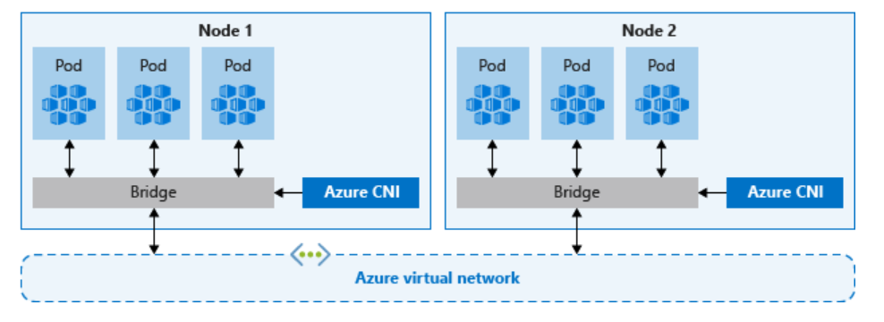
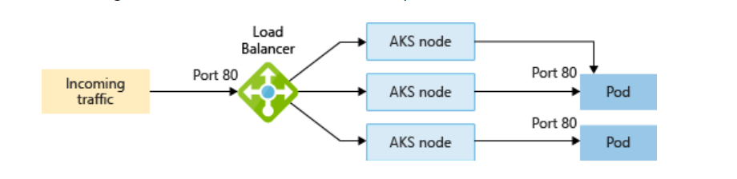

# Advanced AKS Networking Lab: CNI Overlay Analysis


## Training Overview
> **Estimated Duration:** 60 minutes  
> **Prerequisites:** 
> - Existing AKS cluster with Azure CNI Overlay networking (without Cilium datapath)
> - use cnioverlay-cilium.md instructions to create two clusters aks-cni-overlay and aks-cilium.  we will be using aks-cni-overlay cluster for this lab.
> - kubectl configured for cluster access
> - Azure CLI installed and authenticated
> - Basic knowledge of Kubernetes networking and load balancers
> **Learning Path:** Advanced Azure Kubernetes Service Networking

## Table of Contents
- [Exercise 1: CNI Overlay Network Analysis](#cni-overlay-network-analysis)
- [Exercise 2: Advanced Load Balancer Services](#advanced-load-balancer-services)
- [Exercise 3: Internal Load Balancer and Traffic Policy Analysis](#internal-load-balancer-analysis)
- [Exercise 4: Network Policy Implementation](#network-policy-implementation)
- [Exercise 5: Application Routing (Managed Ingress)](#create-a-cluster-with-application-routing)

## Key Learning Objectives
By the end of this lab module, you will be able to:
- Analyze Azure CNI Overlay networking behavior in existing clusters
- Configure advanced load balancer scenarios with traffic policies
- Implement and test external traffic policy configurations
- Deploy network policies for pod-to-pod communication control
- Understand source IP preservation and health check mechanisms
- Troubleshoot complex networking scenarios in production environments

## Prerequisites Validation
Before starting the lab exercises, verify your environment:

```bash
# Verify cluster access
kubectl get nodes -o wide

# Check cluster networking configuration
kubectl get configmap -n kube-system | grep azure

# Verify cluster is using CNI Overlay (check for azure-ip-masq-agent-config configmap)
# kubectl get configmap azure-ip-masq-agent-config-reconciled -n kube-system
kubectl describe configmap azure-ip-masq-agent-config -n kube-system

# For detailed configuration, view the configmap data:
kubectl get configmap azure-ip-masq-agent-config-reconciled -n kube-system -o yaml
```

**Understanding the IP Masquerading Configuration:**

The `azure-ip-masq-agent-config-reconciled` ConfigMap controls how traffic is masqueraded (SNAT'd) in your CNI Overlay cluster:

- **`MasqLinkLocal: true`**: Link-local addresses (169.254.0.0/16) are masqueraded when leaving the node. This ensures traffic to Azure metadata services appears to come from the node IP.

- **`NonMasqueradeCIDRs: - 10.244.0.0/16`**: Traffic within the pod CIDR range (10.244.0.0/16) is NOT masqueraded, preserving source IP addresses for pod-to-pod communication.

This configuration enables:
- Pod-to-pod communication with preserved source IPs
- Proper external connectivity through node IP masquerading  
- Correct routing to Azure services via link-local addresses

```bash

# Check for absence of Cilium (should show no Cilium pods)
kubectl get pods -n kube-system | grep cilium


```

## Connectivity Testing Setup
> 🔧 **Important:** This lab focuses on internal networking. For testing connectivity to internal load balancers, ensure you have:
> - Azure Bastion Host configured in your VNet, OR
> - A jump box VM in the same VNet/peered VNet, OR  
> - VPN/ExpressRoute connection to the AKS VNet
> 
> **Recommended:** Use Azure Bastion for secure, browser-based access to test VMs without requiring public IPs.

## Important Notes for Participants
> ⚠️ **Existing Cluster:** This lab assumes you have an existing AKS cluster with CNI Overlay networking without Cilium datapath  
> � **Network Policy Enforcement:** For network policies to work, your cluster must have either Azure Network Policy Manager (Azure NPM) or Calico installed. Without a policy engine, network policies will be ignored.  
> �📝 **Best Practice:** Monitor resource creation and cleanup applications when finished  
> 🔍 **Advanced Focus:** This lab covers advanced networking concepts suitable for production environments
## Exercise 1: CNI Overlay Network Analysis {#cni-overlay-network-analysis}

### Background and Context
Azure CNI Overlay is an advanced networking mode that provides better integration with Azure networking services while maintaining pod IP address conservation. In this exercise, you'll analyze the networking behavior of your existing CNI Overlay cluster.



### Key Concepts to Understand
- **CNI Overlay:** Advanced Container Network Interface with Azure integration
- **Pod IP Management:** Pods receive IPs from overlay network (not VNet address space)
- **Node Communication:** Direct VNet integration for nodes
- **Network Policies:** Support for Kubernetes network policies without Cilium datapath
- **Multi-Subnet Support:** Ability to span multiple subnets

### Learning Outcomes
Upon completion of this exercise, you will understand:
- How Azure CNI overlay operates in production environments
- Pod and node IP allocation strategies in overlay mode
- Network communication patterns between pods and external resources
- Advanced troubleshooting techniques for CNI overlay networking

### Step 1: Cluster Network Analysis

#### 1.1 Examine Current Network Configuration
```bash
# Get detailed node information
kubectl get nodes -o wide

# Examine cluster networking details
kubectl get pods -n kube-system -o wide | grep azure

# Check CNI configuration
kubectl describe configmap azure-ip-masq-agent-config -n kube-system

# View cluster network info
# kubectl cluster-info dump | grep -i "cluster-cidr\|service-cidr\|pod-cidr"
# use az command to check network info- check networkProfile
az aks show -n clname -g rgname   
```

#### 1.2 Deploy Test Workloads for Analysis
```bash
# Create test deployment across multiple nodes
kubectl create deployment network-test --image=nginx --replicas=4
```

# Create a debugging pod for network analysis

```bash  
cat <<EOF | kubectl apply -f -
apiVersion: v1
kind: Pod
metadata:
  name: netshoot
  labels:
    app: netshoot
spec:
  containers:
  - name: netshoot
    image: nicolaka/netshoot
    command: ["/bin/bash"]
    args: ["-c", "sleep 3600"]
EOF
```

#### 1.3 Analyze Pod Distribution and IP Allocation
```bash
# Check pod distribution across nodes
kubectl get pods -l app=network-test -o wide

# Examine pod IP ranges (should be overlay network)
kubectl get pods --all-namespaces -o wide | grep -v "HOST"

# Compare node IPs vs pod IPs
echo "=== NODE IPs ==="
kubectl get nodes -o jsonpath='{range .items[*]}{.metadata.name}{"\t"}{.status.addresses[?(@.type=="InternalIP")].address}{"\n"}{end}'

echo "=== POD IPs ==="
kubectl get pods -l app=network-test -o jsonpath='{range .items[*]}{.metadata.name}{"\t"}{.status.podIP}{"\n"}{end}'
```
You may see node IPs with kubectl get pods --all-namespaces -o wide      
Understand why

### Step 2: Network Connectivity Analysis

#### 2.1 Test Pod-to-Pod Communication
```bash
# Get pod IPs for testing
POD1_IP=$(kubectl get pod -l app=network-test -o jsonpath='{.items[0].status.podIP}')
POD2_IP=$(kubectl get pod -l app=network-test -o jsonpath='{.items[1].status.podIP}')

echo "Testing communication between pods:"
echo "Pod 1 IP: $POD1_IP"
echo "Pod 2 IP: $POD2_IP"

# Test connectivity from netshoot pod
kubectl exec netshoot -- ping -c 3 $POD1_IP
kubectl exec netshoot -- ping -c 3 $POD2_IP

# Test HTTP connectivity
kubectl exec netshoot -- curl -s http://$POD1_IP
kubectl exec netshoot -- curl -s http://$POD2_IP

```

#### 2.2 Analyze Network Routes and Interfaces
```bash
# Examine network interfaces in pods
kubectl exec netshoot -- ip addr show

# Check routing tables
kubectl exec netshoot -- ip route

# Compare with node networking (for contrast)
kubectl debug node/<node-name> -it --image=nicolaka/netshoot
# Then inside the debug pod:
ip addr show
ip route
exit
```

#### 2.3 DNS Resolution Testing
```bash
# Test internal DNS resolution
kubectl exec netshoot -- nslookup kubernetes.default.svc.cluster.local

# Test external DNS resolution
kubectl exec netshoot -- nslookup google.com

# Test service discovery
kubectl expose deployment network-test --port=80 --type=ClusterIP
kubectl exec netshoot -- nslookup network-test.default.svc.cluster.local

# Understand how service discovery is helpful with the command below  
kubectl exec netshoot -- curl -s http://network-test.default.svc.cluster.local
```

### Key Differences: CNI Overlay Behavior

| Feature | CNI Overlay (without Cilium) | Traditional CNI |
|---------|-------------------------------|-----------------|
| Pod IPs | Overlay network (192.168.x.x) | VNet subnet IPs |
| Network Policies | Basic kube-proxy based | Full Azure CNI support |
| Node Integration | Direct VNet connection | Direct VNet connection |
| IP Efficiency | Very High | Medium |
| Performance | Good (overlay overhead) | Best (direct) |
| Scalability | Excellent | Good |

## Exercise 2: Advanced Load Balancer Services {#advanced-load-balancer-services}

### Background and Context
Azure Load Balancer integration with AKS provides robust traffic distribution and high availability for your applications. This exercise focuses on internal load balancer configurations, demonstrating real-world patterns for application exposure within VNet environments.



### Key Concepts to Understand
- **Internal Load Balancer (ILB):** Routes traffic within the VNet and peered networks
- **Service Annotations:** Control Azure-specific load balancer behavior
- **Network Security Groups:** Control traffic flow to applications
- **Cross-Subnet Communication:** Understanding VNet-level connectivity
- **Bastion/Jump Box Access:** Secure methods for testing internal services

### Learning Outcomes
Upon completion of this exercise, you will understand:
- How to create and configure internal load balancer services
- Techniques for accessing applications from internal networks using Bastion/Jump Box
- Methods to create load balancers in specific subnets
- Advanced load balancer annotations and configurations
- How to test internal connectivity securely without public IPs

### Step 1: Application Deployment

#### 1.1 Create Base Application
```bash
# Deploy nginx application
kubectl create deployment nginxapp --image=nginx

# Verify deployment
kubectl get deployment nginxapp
kubectl get pods -l app=nginxapp
```

### Step 2: Internal Load Balancer Configuration

Review LB in MC resource groups before starting this exercise.  

#### 2.1 Create Internal Load Balancer Service

```bash
cat <<EOF | kubectl apply -f -
apiVersion: v1
kind: Service
metadata:
  name: nginxsvc
  annotations:
    service.beta.kubernetes.io/azure-load-balancer-internal: "true"
spec:
  type: LoadBalancer
  ports:
  - port: 80
  selector:
    app: nginxapp
EOF
```

#### 2.2 Verify Internal Load Balancer Creation
```bash
# Check service status
kubectl get svc nginxsvc

# Get detailed service information
kubectl describe svc nginxsvc
```

**Key Learning Point:** The internal load balancer IP comes from the same subnet as your AKS nodes.

#### 2.3 Test Internal Connectivity
**Using Azure Bastion (Recommended):**
```bash
# Get the service IP for testing
SERVICE_IP=$(kubectl get svc nginxsvc -o jsonpath='{.status.loadBalancer.ingress[0].ip}')
echo "Internal Load Balancer IP: $SERVICE_IP"

# Note: You'll need to access this IP from a VM connected via Azure Bastion or from a laptop/desktop that connect to IP from the subnet
# Example commands to run from Bastion-connected VM:
curl http://$SERVICE_IP
wget -qO- http://$SERVICE_IP
```

**Alternative Testing Methods:**
```bash
# Option 1: Test from another pod within the cluster - this is not really testing access via LB service you just created - FYI
kubectl exec netshoot -- curl -s http://$SERVICE_IP

# Option 2: Port-forward for local testing (limited to specific pods)  - this is not really testing access via LB service you just created - FYI
kubectl port-forward svc/nginxsvc 8080:80
# Then access via: http://localhost:8080
```

**Result:** The application should be accessible from within the VNet or through Bastion-connected resources.

### Step 3: Advanced Internal Load Balancer Scenarios

#### 3.1 Create Additional Internal Load Balancer for Comparison

```bash
# Create another internal load balancer for testing different configurations
cat <<EOF | kubectl apply -f -
apiVersion: v1
kind: Service
metadata:
  name: nginxsvc-secondary
  annotations:
    service.beta.kubernetes.io/azure-load-balancer-internal: "true"
spec:
  type: LoadBalancer
  ports:
  - port: 80
  selector:
    app: nginxapp
EOF
```

#### 3.2 Test Multi-Service Internal Connectivity
```bash
# Get both internal IPs for testing
INTERNAL_IP_1=$(kubectl get svc nginxsvc -o jsonpath='{.status.loadBalancer.ingress[0].ip}')
INTERNAL_IP_2=$(kubectl get svc nginxsvc-secondary -o jsonpath='{.status.loadBalancer.ingress[0].ip}')

echo "Primary Internal LB IP: $INTERNAL_IP_1"
echo "Secondary Internal LB IP: $INTERNAL_IP_2"

# Test both services from within cluster
kubectl run netshoot --image=nicolaka/netshoot --rm -it --restart=Never -- bash
# Inside the pod:
# curl http://$INTERNAL_IP_1
# curl http://$INTERNAL_IP_2
```

#### 3.3 Analyze Internal Load Balancer Configuration
Use the Azure Portal to examine:
1. The Standard Load Balancer created for your cluster (check Frontend IP configurations)
2. Backend pools pointing to your nodes (all should show private IPs)
3. Load balancing rules for your internal services
4. Health probes configuration for internal services
5. Network Security Group rules (should not require public internet access)

### Step 4: External Traffic Policy for Internal Load Balancers

#### 4.1 Understanding Traffic Policy for Internal Services

The `externalTrafficPolicy: Local` setting works for internal load balancers and optimizes traffic routing by:
- Preserving client source IP addresses from within the VNet
- Routing traffic only to nodes with healthy pods
- Reducing latency by avoiding extra network hops within the VNet
- Providing better load distribution control for internal clients

This is particularly important in production environments for:
- Application logging and monitoring (preserving internal client IPs)
- Security policies based on internal source IP addresses  
- Compliance requirements for internal audit trails
- Optimizing network performance within the VNet

## Exercise 3: Internal Load Balancer and Traffic Policy Analysis {#internal-load-balancer-analysis}

This exercise focuses on understanding internal load balancers and external traffic policies in a production AKS environment where applications are accessed through private networks.

### 3.1 Clean Environment and Deploy Test Application

Start with a clean environment for focused testing:
```bash
# Clean up any existing deployments and services
kubectl delete deployment --all
kubectl delete service --all

# Create a simple test application with a single replicas
kubectl create deployment test-app --image=nginx --replicas=1

# Wait for pods to be ready and check distribution
kubectl get pods -l app=test-app -o wide
```

### 3.2 Create Internal Load Balancer Service (Default Policy)

```bash
# Create internal load balancer service with default externalTrafficPolicy (Cluster)
cat <<EOF | kubectl apply -f -
apiVersion: v1
kind: Service
metadata:
  name: svc-cluster-policy
  annotations:
    service.beta.kubernetes.io/azure-load-balancer-internal: "true"
spec:
  type: LoadBalancer
  ports:
  - port: 80
  selector:
    app: test-app
EOF

# Wait for internal IP assignment
kubectl get svc svc-cluster-policy -w
```

### 3.3 Analyze Internal Load Balancer Configuration

> 📋 **Analysis Task:** Navigate to the Azure Portal and examine the MC_* resource group:
> 1. Locate the **Standard Load Balancer** for your cluster
> 2. Go to **Load balancing rules** → Find the rule for `svc-cluster-policy`
> 3. Examine:
>    - **Frontend IP configuration** (should show private IP from VNet)
>    - **Backend pool** (should show all cluster nodes)
>    - **Health probe** configuration
>    - **Port configuration**
> 4. Under 'Load balancing rules', Click **Health status** → **View details** to see backend instance states
> 5. Note that **all nodes appear in the backend pool** with internal IPs

### 3.4 Test Internal Load Balancer Connectivity

**Using Azure Bastion (Recommended):**
```bash
# Get the internal load balancer IP
INTERNAL_LB_IP=$(kubectl get svc svc-cluster-policy -o jsonpath='{.status.loadBalancer.ingress[0].ip}')
echo "Internal Load Balancer IP: $INTERNAL_LB_IP"

# Document this IP for Bastion testing
echo "Access this application via Azure Bastion-connected VM or network connected laptop : http://$INTERNAL_LB_IP"
```


### 3.5 Create Load Balancer Service with Local Traffic Policy

```bash
# Create internal load balancer service with externalTrafficPolicy: Local
cat <<EOF | kubectl apply -f -
apiVersion: v1
kind: Service
metadata:
  name: svc-local-policy
  annotations:
    service.beta.kubernetes.io/azure-load-balancer-internal: "true"
spec:
  type: LoadBalancer
  externalTrafficPolicy: Local
  ports:
  - port: 80
  selector:
    app: test-app
EOF
```
# Wait for internal IP assignment
```bash
kubectl get svc svc-local-policy -w
```


**Step 5: Analyze Local Traffic Policy Load Balancer Configuration**

> 📋 **Analysis Task:** Return to the Azure Portal and examine the changes:
> 1. Find the new **Load balancing rule** for `svc-local-policy`
> 2. Compare with the previous service:
>    - **Backend pool** (same nodes, but health probe behavior differs)
>    - **Health probe** (note the different port - this is the HealthCheck NodePort)
>    - **Health status** → **Load Balancing Rules --> View details** (some nodes may show as unhealthy)
> 3. **Key Observation #1:** Notice the **HealthCheck NodePort** in the service description
> 4. **Key Observation #2:** LB rule for the service with externalTrafficPolicy: Local  has some unhealthy instances

Use this following command to drain pods from all the nodes except one  or you can scale replicas for the deployment

for draining node use the following
```bash 
kubectl drain nnnnnn1-3 --ignore-daemonsets
```
for scaling replicas, use the following 
k scale deploy test-app --replicas=2
check Load Balancing Rules --> View details again (or click Refresh if already in same screen).   This should show only one node state up and others down
k scale deploy test-app --replicas=1

  

**Step 6: Investigate Health Check Mechanism**  -- OPTIONAL STEP
 
```bash
# Deploy troubleshooting pod for network analysis
kubectl run netshoot --image=nicolaka/netshoot --rm -it --restart=Never -- bash

# If the above doesn't work, deploy it as a regular pod
cat <<EOF | kubectl apply -f -
apiVersion: v1
kind: Pod
metadata:
  name: netshoot
spec:
  containers:
  - name: netshoot
    image: nicolaka/netshoot
    command: ["/bin/bash"]
    args: ["-c", "sleep 3600"]
EOF
```

**Step 7: Examine Health Check NodePorts**   -- OPTIONAL STEP   

```bash
# Get service details and extract health check information for svc-local-policy - notice the difference  
kubectl describe svc svc-cluster-policy
kubectl describe svc svc-local-policy

# Extract the HealthCheck NodePort (look for the high-numbered port)
HEALTH_CHECK_PORT=$(kubectl get svc svc-local-policy -o jsonpath='{.spec.healthCheckNodePort}')
echo "HealthCheck NodePort: $HEALTH_CHECK_PORT"

# Get node IPs for testing
kubectl get nodes -o wide

# Store node IPs in variables for easier testing
NODE1_IP=$(kubectl get nodes -o jsonpath='{.items[0].status.addresses[?(@.type=="InternalIP")].address}')
NODE2_IP=$(kubectl get nodes -o jsonpath='{.items[1].status.addresses[?(@.type=="InternalIP")].address}')

echo "Node 1 IP: $NODE1_IP"
echo "Node 2 IP: $NODE2_IP"
```

**Step 8: Test Health Check Endpoints**

```bash
# From the netshoot pod, test the health check endpoints
kubectl exec netshoot -- curl -s http://$NODE1_IP:$HEALTH_CHECK_PORT/healthz
kubectl exec netshoot -- curl -s http://$NODE2_IP:$HEALTH_CHECK_PORT/healthz

# The output should show something like:
# {
#   "service": {
#     "namespace": "default", 
#     "name": "svc-local-policy"
#   },
#   "localEndpoints": 2,
#   "serviceProxyHealthy": true
# }
```

**Expected Health Check Responses:**
- **Nodes with pods:** `"serviceProxyHealthy": true` and `"localEndpoints": > 0`
- **Nodes without pods:** `"serviceProxyHealthy": false` and `"localEndpoints": 0`

**Step 9: Deploy Source IP Test Application**

```bash
# Deploy an application that shows client source IP information
cat <<EOF | kubectl apply -f -
apiVersion: apps/v1
kind: Deployment
metadata:
  name: source-ip-test
spec:
  replicas: 3
  selector:
    matchLabels:
      app: source-ip-test
  template:
    metadata:
      labels:
        app: source-ip-test
    spec:
      containers:
      - name: source-ip-test
        image: registry.k8s.io/e2e-test-images/agnhost:2.43
        ports:
        - containerPort: 8080
        command:
        - /agnhost
        - netexec
        - --http-port=8080
        - --delay-shutdown=1
---
apiVersion: v1
kind: Service
metadata:
  name: source-ip-cluster-svc
  annotations:
    service.beta.kubernetes.io/azure-load-balancer-internal: "true"
spec:
  type: LoadBalancer
  ports:
  - port: 80
    targetPort: 8080
  selector:
    app: source-ip-test
---
apiVersion: v1
kind: Service
metadata:
  name: source-ip-local-svc
  annotations:
    service.beta.kubernetes.io/azure-load-balancer-internal: "true"
spec:
  type: LoadBalancer
  externalTrafficPolicy: Local
  ports:
  - port: 80
    targetPort: 8080
  selector:
    app: source-ip-test
EOF

# Wait for services to get external IPs
kubectl get svc source-ip-cluster-svc source-ip-local-svc -w
```

### 3.6 Test Source IP Preservation with Internal Load Balancers

```bash
# Get service IPs for testing
SVC_CLUSTER_IP=$(kubectl get svc source-ip-cluster-svc -o jsonpath='{.status.loadBalancer.ingress[0].ip}')
SVC_LOCAL_IP=$(kubectl get svc source-ip-local-svc -o jsonpath='{.status.loadBalancer.ingress[0].ip}')

echo "Cluster Policy Service IP: $SVC_CLUSTER_IP"
echo "Local Policy Service IP: $SVC_LOCAL_IP"

# Test from netshoot pod - this will show the actual client IP
echo "=== Testing Cluster Policy (may show SNAT'd IP) ==="
kubectl exec netshoot -- curl -s $SVC_CLUSTER_IP/clientip

echo ""
echo "=== Testing Local Policy (should preserve source IP) ==="
kubectl exec netshoot -- curl -s $SVC_LOCAL_IP/clientip

# Get the netshoot pod IP for comparison
NETSHOOT_IP=$(kubectl get pod netshoot -o jsonpath='{.status.podIP}')
echo ""
echo "Netshoot Pod IP for reference: $NETSHOOT_IP"
```

**Expected Results:**
- **Cluster Policy:** May show a different IP (SNAT'd by kube-proxy or node)
- **Local Policy:** Should show the actual netshoot pod IP (preserved)

### 3.7 Test from Azure Bastion for Real Client IP Analysis

**Connecting via Azure Bastion:**
1. Set up Azure Bastion in your VNet (if not already configured)
2. Connect to a VM in the same VNet through Bastion
3. From the Bastion-connected VM, test the services:

```bash
# Commands to run from your Bastion-connected VM
# Get the VM's internal IP for reference
VM_INTERNAL_IP=$(hostname -I | awk '{print $1}')
echo "VM Internal IP: $VM_INTERNAL_IP"

# Test both services (replace with actual service IPs)
echo "=== Testing Cluster Policy from Bastion-connected VM ==="
curl -s http://<cluster-policy-service-ip>/clientip

echo ""
echo "=== Testing Local Policy from Bastion-connected VM ==="
curl -s http://<local-policy-service-ip>/clientip
```


**Bastion Test Expected Results:**
- **Cluster Policy:** May show the node IP instead of the VM IP
- **Local Policy:** Should show the actual VM internal IP (from Bastion session)

### 3.8 Monitor Load Balancer Health Status

In the Azure Portal, monitor the load balancer health status changes as you:
1. Scale pods up and down
2. Cordon/uncordon nodes  
3. Apply different external traffic policies

**Real-time Monitoring Commands:**
```bash
# Watch service status changes
kubectl get svc -w

# Monitor pod distribution changes
kubectl get pods -o wide -w

# Check health probe status via kubectl
kubectl get events --field-selector type=Warning
```

This real-time observation helps understand production load balancer behavior in internal-only networking scenarios.

### Advanced Traffic Policy Scenarios

#### Scenario 1: Multi-Zone Deployment with Local Policy
```bash
# Label nodes by zone (simulate multi-AZ deployment)
kubectl label nodes <node1> topology.kubernetes.io/zone=zone-a
kubectl label nodes <node2> topology.kubernetes.io/zone=zone-b

# Deploy with zone anti-affinity
cat <<EOF | kubectl apply -f -
apiVersion: apps/v1
kind: Deployment
metadata:
  name: zone-aware-app
spec:
  replicas: 4
  selector:
    matchLabels:
      app: zone-aware-app
  template:
    metadata:
      labels:
        app: zone-aware-app
    spec:
      affinity:
        podAntiAffinity:
          preferredDuringSchedulingIgnoredDuringExecution:
          - weight: 100
            podAffinityTerm:
              labelSelector:
                matchExpressions:
                - key: app
                  operator: In
                  values:
                  - zone-aware-app
              topologyKey: topology.kubernetes.io/zone
      containers:
      - name: app
        image: nginx
        ports:
        - containerPort: 80
EOF

# Create service with local traffic policy
kubectl expose deployment zone-aware-app --type=LoadBalancer --external-traffic-policy=Local
```

#### Scenario 2: Session Affinity with Traffic Policy
```bash
# Deploy application with session affinity
cat <<EOF | kubectl apply -f -
apiVersion: v1
kind: Service
metadata:
  name: session-affinity-svc
  annotations:
    service.beta.kubernetes.io/azure-load-balancer-internal: "true"
spec:
  type: LoadBalancer
  externalTrafficPolicy: Local
  sessionAffinity: ClientIP
  sessionAffinityConfig:
    clientIP:
      timeoutSeconds: 3600
  ports:
  - port: 80
  selector:
    app: zone-aware-app
EOF

# Test session affinity behavior
kubectl get svc session-affinity-svc
# Test multiple requests from same client to verify sticky sessions
```

## Exercise 4: Network Policy Implementation {#network-policy-implementation}

### Background and Context
Network policies in CNI Overlay (without Cilium) provide basic pod-to-pod communication control using standard Kubernetes network policies implemented via kube-proxy and iptables.

> ⚠️ **Important Network Policy Dependency:**  
> Since this cluster uses CNI Overlay **without Cilium datapath**, network policy enforcement requires either:
> - **Azure Network Policy Manager (Azure NPM)** - Microsoft's network policy implementation
> - **Calico** - Open-source network and network security solution  
> 
> Without one of these policy engines installed, Kubernetes network policies will be accepted by the API server but **will not be enforced**. Check your cluster's network policy configuration before proceeding.

### Verify Network Policy Engine
```bash
# Check for Azure NPM pods
kubectl get pods -n kube-system | grep azure-npm

# Check for Calico pods  
kubectl get pods -n kube-system | grep calico

# If neither is found, network policies will not be enforced
echo "If no network policy engine is found, policies will be ignored"
```

### Learning Outcomes
- Implement network policies for micro-segmentation
- Test network policy effectiveness in CNI Overlay
- Understand limitations without Cilium datapath
- Apply production-ready security policies

### Step 1: Deploy Multi-Tier Application

#### 1.1 Create Namespace and Applications
```bash
# Create dedicated namespace
kubectl create namespace netpol-demo

# Deploy frontend application
cat <<EOF | kubectl apply -f -
apiVersion: apps/v1
kind: Deployment
metadata:
  name: frontend
  namespace: netpol-demo
  labels:
    tier: frontend
spec:
  replicas: 2
  selector:
    matchLabels:
      tier: frontend
  template:
    metadata:
      labels:
        tier: frontend
        app: frontend
    spec:
      containers:
      - name: frontend
        image: nginx
        ports:
        - containerPort: 80
---
apiVersion: apps/v1
kind: Deployment
metadata:
  name: backend
  namespace: netpol-demo
  labels:
    tier: backend
spec:
  replicas: 2
  selector:
    matchLabels:
      tier: backend
  template:
    metadata:
      labels:
        tier: backend
        app: backend
    spec:
      containers:
      - name: backend
        image: nginx
        ports:
        - containerPort: 80
---
apiVersion: apps/v1
kind: Deployment
metadata:
  name: database
  namespace: netpol-demo
  labels:
    tier: database
spec:
  replicas: 1
  selector:
    matchLabels:
      tier: database
  template:
    metadata:
      labels:
        tier: database
        app: database
    spec:
      containers:
      - name: database
        image: nginx
        ports:
        - containerPort: 80
EOF

# Create services for each tier
kubectl expose deployment frontend --port=80 --namespace=netpol-demo
kubectl expose deployment backend --port=80 --namespace=netpol-demo
kubectl expose deployment database --port=80 --namespace=netpol-demo
```

#### 1.2 Test Initial Connectivity (Before Network Policies)
```bash
# Deploy test pod in the namespace
kubectl run test-pod --image=nicolaka/netshoot --namespace=netpol-demo --rm -it --restart=Never -- bash

# Inside the test pod, test connectivity to all tiers:
curl frontend.netpol-demo.svc.cluster.local
curl backend.netpol-demo.svc.cluster.local
curl database.netpol-demo.svc.cluster.local
exit
```

### Step 2: Implement Progressive Network Policies

#### 2.1 Default Deny Policy
```bash
# Create default deny all ingress policy
cat <<EOF | kubectl apply -f -
apiVersion: networking.k8s.io/v1
kind: NetworkPolicy
metadata:
  name: default-deny-ingress
  namespace: netpol-demo
spec:
  podSelector: {}
  policyTypes:
  - Ingress
EOF

# Test connectivity again (should fail)
kubectl run test-pod --image=nicolaka/netshoot --namespace=netpol-demo --rm -it --restart=Never -- bash
# Try curling the services - should timeout
```

#### 2.2 Allow Frontend to Backend Communication
```bash
# Allow frontend to access backend
cat <<EOF | kubectl apply -f -
apiVersion: networking.k8s.io/v1
kind: NetworkPolicy
metadata:
  name: allow-frontend-to-backend
  namespace: netpol-demo
spec:
  podSelector:
    matchLabels:
      tier: backend
  policyTypes:
  - Ingress
  ingress:
  - from:
    - podSelector:
        matchLabels:
          tier: frontend
    ports:
    - protocol: TCP
      port: 80
EOF
```

#### 2.3 Allow Backend to Database Communication
```bash
# Allow backend to access database
cat <<EOF | kubectl apply -f -
apiVersion: networking.k8s.io/v1
kind: NetworkPolicy
metadata:
  name: allow-backend-to-database
  namespace: netpol-demo
spec:
  podSelector:
    matchLabels:
      tier: database
  policyTypes:
  - Ingress
  ingress:
  - from:
    - podSelector:
        matchLabels:
          tier: backend
    ports:
    - protocol: TCP
      port: 80
EOF
```

#### 2.4 Allow External Access to Frontend
```bash
# Allow external access to frontend (from any namespace or external)
cat <<EOF | kubectl apply -f -
apiVersion: networking.k8s.io/v1
kind: NetworkPolicy
metadata:
  name: allow-external-to-frontend
  namespace: netpol-demo
spec:
  podSelector:
    matchLabels:
      tier: frontend
  policyTypes:
  - Ingress
  ingress:
  - {} # Allow all ingress
EOF
```

### Step 3: Test Network Policy Effectiveness

#### 3.1 Test Allowed Communications
```bash
# Test from frontend pod to backend (should work)
FRONTEND_POD=$(kubectl get pod -l tier=frontend -n netpol-demo -o jsonpath='{.items[0].metadata.name}')
kubectl exec -n netpol-demo $FRONTEND_POD -- curl -s backend.netpol-demo.svc.cluster.local

# Test from backend pod to database (should work)
BACKEND_POD=$(kubectl get pod -l tier=backend -n netpol-demo -o jsonpath='{.items[0].metadata.name}')
kubectl exec -n netpol-demo $BACKEND_POD -- curl -s database.netpol-demo.svc.cluster.local
```

#### 3.2 Test Blocked Communications
```bash
# Test from frontend directly to database (should be blocked)
kubectl exec -n netpol-demo $FRONTEND_POD -- curl -s --connect-timeout 5 database.netpol-demo.svc.cluster.local

# Test from external test pod to backend (should be blocked)
kubectl run test-external --image=nicolaka/netshoot --namespace=default --rm -it --restart=Never -- curl -s --connect-timeout 5 backend.netpol-demo.svc.cluster.local
```

### Step 4: Advanced Network Policy Scenarios

#### 4.1 Egress Controls
```bash
# Implement egress policy for database (prevent external access)
cat <<EOF | kubectl apply -f -
apiVersion: networking.k8s.io/v1
kind: NetworkPolicy
metadata:
  name: database-egress-policy
  namespace: netpol-demo
spec:
  podSelector:
    matchLabels:
      tier: database
  policyTypes:
  - Egress
  egress:
  - to:
    - namespaceSelector:
        matchLabels:
          name: kube-system
  - to: []
    ports:
    - protocol: UDP
      port: 53
    - protocol: TCP
      port: 53
EOF
```

#### 4.2 Namespace-Level Policies
```bash
# Create a separate namespace for testing
kubectl create namespace external-app
kubectl label namespace external-app name=external-app

# Deploy app in external namespace
kubectl run external-app --image=nginx --namespace=external-app

# Create policy allowing access from specific namespace
cat <<EOF | kubectl apply -f -
apiVersion: networking.k8s.io/v1
kind: NetworkPolicy
metadata:
  name: allow-from-external-namespace
  namespace: netpol-demo
spec:
  podSelector:
    matchLabels:
      tier: frontend
  policyTypes:
  - Ingress
  ingress:
  - from:
    - namespaceSelector:
        matchLabels:
          name: external-app
    ports:
    - protocol: TCP
      port: 80
EOF
```

## Exercise 5: Pod Network Security {#pod-network-security}

### Background and Context
This exercise focuses on advanced pod network security scenarios that are common in production environments, including service mesh preparation, security scanning, and network monitoring.

### Step 1: Pod Security Context and Network Isolation

#### 1.1 Deploy Security-Enhanced Pods
```bash
# Deploy pods with security context
cat <<EOF | kubectl apply -f -
apiVersion: apps/v1
kind: Deployment
metadata:
  name: secure-app
  namespace: netpol-demo
spec:
  replicas: 2
  selector:
    matchLabels:
      app: secure-app
  template:
    metadata:
      labels:
        app: secure-app
        security-level: high
    spec:
      securityContext:
        runAsNonRoot: true
        runAsUser: 1000
        fsGroup: 2000
      containers:
      - name: app
        image: nginx:alpine
        securityContext:
          allowPrivilegeEscalation: false
          readOnlyRootFilesystem: true
          capabilities:
            drop:
            - ALL
            add:
            - NET_BIND_SERVICE
        ports:
        - containerPort: 80
        volumeMounts:
        - name: tmp
          mountPath: /tmp
        - name: var-cache-nginx
          mountPath: /var/cache/nginx
        - name: var-run
          mountPath: /var/run
      volumes:
      - name: tmp
        emptyDir: {}
      - name: var-cache-nginx
        emptyDir: {}
      - name: var-run
        emptyDir: {}
EOF
```

#### 1.2 Network Monitoring and Troubleshooting
```bash
# Deploy network monitoring tools
cat <<EOF | kubectl apply -f -
apiVersion: v1
kind: Pod
metadata:
  name: network-monitor
  namespace: netpol-demo
  labels:
    app: network-monitor
spec:
  containers:
  - name: monitor
    image: nicolaka/netshoot
    command: ["/bin/bash"]
    args: ["-c", "while true; do netstat -i; sleep 30; done"]
    securityContext:
      capabilities:
        add:
        - NET_ADMIN
        - NET_RAW
EOF

# Monitor network statistics
kubectl logs -f network-monitor -n netpol-demo
```

#### 1.3 Service Mesh Preparation
```bash
# Deploy applications ready for service mesh injection
cat <<EOF | kubectl apply -f -
apiVersion: v1
kind: Namespace
metadata:
  name: service-mesh-ready
  labels:
    istio-injection: disabled  # Ready for future enablement
---
apiVersion: apps/v1
kind: Deployment
metadata:
  name: mesh-app-v1
  namespace: service-mesh-ready
spec:
  replicas: 2
  selector:
    matchLabels:
      app: mesh-app
      version: v1
  template:
    metadata:
      labels:
        app: mesh-app
        version: v1
    spec:
      containers:
      - name: app
        image: nginx:alpine
        ports:
        - containerPort: 80
        env:
        - name: VERSION
          value: "v1"
---
apiVersion: apps/v1
kind: Deployment
metadata:
  name: mesh-app-v2
  namespace: service-mesh-ready
spec:
  replicas: 2
  selector:
    matchLabels:
      app: mesh-app
      version: v2
  template:
    metadata:
      labels:
        app: mesh-app
        version: v2
    spec:
      containers:
      - name: app
        image: nginx:alpine
        ports:
        - containerPort: 80
        env:
        - name: VERSION
          value: "v2"
---
apiVersion: v1
kind: Service
metadata:
  name: mesh-app
  namespace: service-mesh-ready
spec:
  selector:
    app: mesh-app
  ports:
  - port: 80
    targetPort: 80
EOF
```

### Step 2: Performance Testing and Optimization

#### 2.1 Network Performance Testing
```bash
# Deploy iperf3 for network performance testing
cat <<EOF | kubectl apply -f -
apiVersion: apps/v1
kind: Deployment
metadata:
  name: iperf3-server
  namespace: netpol-demo
spec:
  replicas: 1
  selector:
    matchLabels:
      app: iperf3-server
  template:
    metadata:
      labels:
        app: iperf3-server
    spec:
      containers:
      - name: iperf3-server
        image: networkstatic/iperf3
        args: ["-s"]
        ports:
        - containerPort: 5201
---
apiVersion: v1
kind: Service
metadata:
  name: iperf3-server
  namespace: netpol-demo
spec:
  selector:
    app: iperf3-server
  ports:
  - port: 5201
    targetPort: 5201
EOF

# Run performance test
kubectl run iperf3-client --image=networkstatic/iperf3 --rm -it --restart=Never --namespace=netpol-demo -- -c iperf3-server.netpol-demo.svc.cluster.local -t 10
```

### Step 3: Cleanup and Best Practices

#### 3.1 Resource Cleanup
```bash
# Clean up test namespaces and resources
kubectl delete namespace netpol-demo
kubectl delete namespace service-mesh-ready
kubectl delete namespace external-app

# Clean up any remaining test pods
kubectl delete pod --all --namespace=default --selector=app=network-test
kubectl delete deployment --all --namespace=default
kubectl delete service --all --namespace=default
```

#### 3.2 Production Best Practices Summary

**Network Policy Best Practices:**
1. **Start with Default Deny:** Always begin with restrictive policies
2. **Progressive Implementation:** Add policies incrementally
3. **Test Thoroughly:** Validate both allowed and blocked traffic
4. **Monitor and Log:** Implement network policy logging
5. **Documentation:** Maintain clear policy documentation

**CNI Overlay Without Cilium Considerations:**
1. **Network Policy Engine Required:** Install Azure NPM or Calico for policy enforcement
2. **Limited Advanced Features:** Basic Kubernetes network policies only (no L7 policies)
3. **Performance:** Good performance with minimal overhead using iptables rules
4. **Monitoring:** Use traditional Kubernetes monitoring tools and Azure Monitor
5. **Troubleshooting:** Rely on kubectl, iptables inspection, and standard debugging tools
6. **Future Migration:** Plan for potential Cilium adoption for advanced networking features

### Recommended Network Policy Engines for CNI Overlay:

**Azure Network Policy Manager (Azure NPM):**
- ✅ Native Azure integration and support
- ✅ Works with both Linux and Windows nodes
- ✅ Supported by Azure Support and Engineering team
- ❌ Limited to basic Kubernetes network policies
- ❌ No advanced features like FQDN policies or L7 filtering

**Calico:**
- ✅ Advanced network policy features beyond Kubernetes spec
- ✅ Strong community and enterprise support
- ✅ Superior observability and troubleshooting tools
- ❌ Linux nodes only
- ❌ Additional operational complexity

### Lab Summary

This advanced lab covered:
- ✅ CNI Overlay network analysis and troubleshooting
- ✅ Advanced load balancer configurations and traffic policies
- ✅ External traffic policy implementation and testing
- ✅ Network policy implementation for micro-segmentation
- ✅ Pod network security and monitoring
- ✅ Performance testing and optimization techniques
- ✅ Production-ready network configurations

### Next Steps

Consider these advanced topics for further learning:
1. **Service Mesh Integration:** Prepare for Istio or Linkerd adoption
2. **Network Monitoring:** Implement Prometheus-based network metrics
3. **Security Scanning:** Regular network policy auditing
4. **Multi-Cluster Networking:** Cross-cluster communication patterns
5. **Disaster Recovery:** Network configuration backup and restore

> 📋 **Final Analysis Task:** Return to Azure Portal:
> 1. Compare **Health status** between both load balancing rules
> 2. **Cluster Policy:** All nodes should be healthy (green)
> 3. **Local Policy:** Only nodes with pods should be healthy (green)
> 4. Unhealthy nodes (red) will not receive traffic for the Local policy service

**Key Learning Points:**
- **externalTrafficPolicy: Cluster** - All nodes are healthy, traffic can be forwarded internally
- **externalTrafficPolicy: Local** - Only nodes with local pods are healthy, no internal forwarding
- **Health Check NodePort** - Special port used by Azure LB to determine node health for Local policy
- **Source IP Preservation** - Local policy preserves client IP, Cluster policy may SNAT it

**Cleanup:**
```bash
# Clean up test resources
kubectl delete pod netshoot
kubectl delete svc svc-cluster-policy svc-local-policy source-ip-cluster-svc source-ip-local-svc
kubectl delete deployment test-app source-ip-test
```

**Expected Behaviors:**
- **externalTrafficPolicy: Local** - Load balancer routes traffic to any healthy node, but nodes without pods may reject the traffic at the health check level
- **externalTrafficPolicy: Cluster** - Traffic can go to any node, with internal forwarding to pods on other nodes if needed
- **NodePort with Local** - Only responds on nodes with pods (connection refused on nodes without pods)
- **NodePort with Cluster** - Responds on all nodes, forwards internally if needed

> **Key Learning Point:** The main difference is observed at the **NodePort level** and in **source IP preservation**, not necessarily in load balancer service accessibility. Azure Load Balancer health checks determine which nodes receive traffic based on the health check NodePort status.

### Understanding External Traffic Policy

#### Key Differences: Local vs Cluster

| Aspect | externalTrafficPolicy: Local | externalTrafficPolicy: Cluster |
|--------|------------------------------|--------------------------------|
| **Traffic Routing** | Only to nodes with healthy pods | To all nodes in cluster |
| **Source IP** | Preserved (no SNAT) | May be SNAT'd to node IP |
| **Load Distribution** | Based on pod distribution across nodes | Even across all nodes |
| **Health Checks** | Uses HealthCheck NodePort | No special health checks |
| **Latency** | Lower (no inter-node routing) | Higher (potential extra hops) |
| **Failure Impact** | Limited to pods on failed nodes | Affects traffic distribution |

#### When to Use Each Policy

**Use `externalTrafficPolicy: Local` when:**
- Source IP preservation is critical for security/logging
- You want to minimize network latency
- You have good pod distribution across nodes
- You need deterministic traffic routing

**Use `externalTrafficPolicy: Cluster` when:**
- You need consistent traffic distribution regardless of pod placement
- Source IP preservation is not important
- You have uneven pod distribution across nodes
- You want maximum availability during node failures

#### Best Practices for External Traffic Policy

1. **Pod Distribution**: Use pod anti-affinity or topology spread constraints to ensure even pod distribution when using Local policy:

```yaml
spec:
  topologySpreadConstraints:
  - maxSkew: 1
    topologyKey: kubernetes.io/hostname
    whenUnsatisfiable: DoNotSchedule
    labelSelector:
      matchLabels:
        app: your-app
```

2. **Graceful Shutdown**: Implement proper shutdown handling with preStop hooks:

```yaml
spec:
  containers:
  - name: app
    lifecycle:
      preStop:
        exec:
          command: ["/bin/sh", "-c", "sleep 10"]
```

3. **Health Checks**: Configure appropriate readiness and liveness probes
4. **Monitoring**: Monitor load balancer health check success rates

### Optional: Network Security Group (NSG) Demonstration

If you want to explore **network-level access controls** in addition to Kubernetes traffic policies, you can optionally implement NSG rules:

#### Create Restrictive NSG (Optional)
```bash
# Create NSG to demonstrate network-level blocking
az network nsg create \
  --resource-group akslabe2rg \
  --name protectfromvm

# Add rule to block VM subnet traffic to subnet2
az network nsg rule create \
  --resource-group akslabe2rg \
  --nsg-name protectfromvm \
  --name DenyFromVMSubnet \
  --protocol Tcp \
  --direction Inbound \
  --priority 100 \
  --source-address-prefix 10.0.3.0/24 \
  --destination-address-prefix 10.0.2.0/24 \
  --destination-port-range 80 \
  --access Deny

# Apply NSG to subnet1 and 2
az network vnet subnet update \
  --resource-group akslabe2rg \
  --vnet-name spokevnet \
  --name subnet \
  --network-security-group protectfromvm 

az network vnet subnet update \
  --resource-group akslabe2rg \
  --vnet-name spokevnet \
  --name subnet2 \
  --network-security-group protectfromvm
```

**Note:** This NSG configuration is separate from the external traffic policy tests and demonstrates Azure network-level security controls rather than Kubernetes-level traffic policies.

### Load Balancer Troubleshooting Guide

#### Common Issues and Solutions

1. **Service Stuck in Pending State**
   - Check managed identity permissions
   - Verify subnet availability
   - Review Azure Load Balancer limits

2. **Cannot Access Internal Service**
   - Verify VNet connectivity
   - Check NSG rules
   - Confirm pod readiness

3. **External IP Not Assigned**
   - Check Azure subscription limits
   - Verify outbound connectivity settings
   - Review load balancer SKU configuration

### Azure Load Balancer Best Practices

1. **Use Standard SKU** for production workloads
2. **Implement health checks** for better availability
3. **Configure session affinity** when needed
4. **Monitor load balancer metrics** in Azure Monitor
5. **Use internal load balancers** for backend services
6. **Implement proper NSG rules** for security   

## Exercise 4: Application Routing (Managed Ingress) {#create-a-cluster-with-application-routing}

### Background and Context
Application Routing is Azure's fully managed ingress solution for AKS, providing a simplified way to expose HTTP and HTTPS routes to your applications. This managed service eliminates the complexity of manual ingress controller setup and maintenance.

**Note:** As of late 2024, Open Service Mesh (OSM) has been retired by CNCF. Microsoft no longer recommends using the application routing add-on with OSM.

### Key Concepts to Understand
- **Managed NGINX Ingress Controller:** Azure-managed NGINX ingress controller based on Kubernetes NGINX Ingress
- **Ingress Resources:** Kubernetes objects that define routing rules with the ingress class `webapprouting.kubernetes.azure.com`
- **Path-Based Routing:** Route traffic based on URL paths
- **SSL/TLS Termination:** Integration with Azure Key Vault for certificate management
- **DNS Integration:** Integration with Azure DNS for public and private zone management

### Learning Outcomes
Upon completion of this exercise, you will understand:
- How to enable application routing on existing AKS clusters
- Configuration of ingress objects for HTTP traffic routing with the proper ingress class
- Implementation of path-based routing patterns
- Integration with Azure networking services
- Best practices for managed ingress controller usage

### Step 1: Enable Application Routing on Existing Cluster

#### 1.1 Enable Application Routing
```bash
# Enable application routing on the existing akscnioverlay cluster
az aks approuting enable \
  -g akslabe2rg \
  -n akscnioverlay 
# This will take a few minutes to complete
```


#### 1.2 Verify Application Routing is Enabled
```bash
# Verify cluster connectivity (you should already be connected from Exercise 3)
kubectl cluster-info

# Check if application routing components are deployed
kubectl get pods -n app-routing-system

#### 1.3 Monitor Application Routing Deployment
```bash

# Get the ingress controller service information
kubectl get service -n app-routing-system nginx
```

#### 1.4 Verify Cluster and Routing Status
```bash
# Confirm we're using the akscnioverlay cluster from previous exercises
kubectl get nodes -o wide

# Check application routing configuration  
az aks show -g akslabe2rg -n akscnioverlay --query "ingressProfile.webAppRouting" -o table
```

### Step 2: Ingress Controller Inspection

#### 2.1 Examine Managed Ingress Components
```bash
# View all services across namespaces (locate ingress controller)
kubectl get svc -A

# Check available ingress classes
kubectl get ingressclass

# Examine ingress controller details
kubectl get pods -n app-routing-system
```

#### 2.2 Note Ingress Controller Configuration
```bash
# Get the external IP of the ingress controller
kubectl get svc -n app-routing-system

# Create sample namespace for testing
kubectl create namespace sample1
```

**Important:** Record the ingress controller's external IP address for later testing.

### Step 3: Application Deployment with Ingress

#### 3.1 Deploy Complete Application Stack

Create a comprehensive deployment with service and ingress:

```bash
cat <<EOF | kubectl apply -f -
apiVersion: apps/v1
kind: Deployment
metadata:
  name: aks-helloworld
  namespace: sample1
spec:
  replicas: 1
  selector:
    matchLabels:
      app: aks-helloworld
  template:
    metadata:
      labels:
        app: aks-helloworld
    spec:
      containers:
      - name: aks-helloworld
        image: mcr.microsoft.com/azuredocs/aks-helloworld:v1
        ports:
        - containerPort: 80
        env:
        - name: TITLE
          value: "Welcome to Azure Kubernetes Service (AKS)"
---
apiVersion: v1
kind: Service
metadata:
  name: aks-helloworld-svc
  namespace: sample1
spec:
  type: ClusterIP
  ports:
  - port: 80
  selector:
    app: aks-helloworld
---
apiVersion: networking.k8s.io/v1
kind: Ingress
metadata:
  name: nginx-ingress
  namespace: sample1
  annotations:
    nginx.ingress.kubernetes.io/rewrite-target: /
spec:
  ingressClassName: webapprouting.kubernetes.azure.com
  rules:
  - http:
      paths:
      - path: /testpath
        pathType: Prefix
        backend:
          service:
            name: aks-helloworld-svc
            port:
              number: 80
EOF
```

### Step 4: Application Testing and Verification

#### 4.1 Verify Deployment Status
```bash
# Check all resources in sample1 namespace
kubectl get all -n sample1

# Examine ingress configuration
kubectl describe ingress nginx-ingress -n sample1

# Check ingress status
kubectl get ingress -n sample1
```

#### 4.2 Test Application Access
```bash
# Get ingress controller external IP
INGRESS_IP=$(kubectl get svc -n app-routing-system -o jsonpath='{.items[0].status.loadBalancer.ingress[0].ip}')

# Test application via curl
curl http://$INGRESS_IP/testpath

# Or access via web browser
# If it's external, you need to update inbound rules to allow traffic - since you are using custom VNET model (not AKS managed).  For internal, it's not required since there is generally a peering of AKS VNET to hub VNET and connectivity to on-prem.  
echo "Access your application at: http://$INGRESS_IP/testpath"
```

### Step 5: Advanced Ingress Configurations

#### 5.1 Multiple Path Routing

Create an additional application with different routing:

```bash
cat <<EOF | kubectl apply -f -
apiVersion: apps/v1
kind: Deployment
metadata:
  name: aks-helloworld-two
  namespace: sample1
spec:
  replicas: 1
  selector:
    matchLabels:
      app: aks-helloworld-two
  template:
    metadata:
      labels:
        app: aks-helloworld-two
    spec:
      containers:
      - name: aks-helloworld
        image: mcr.microsoft.com/azuredocs/aks-helloworld:v1
        ports:
        - containerPort: 80
        env:
        - name: TITLE
          value: "AKS Ingress Demo - App Two"
---
apiVersion: v1
kind: Service
metadata:
  name: aks-helloworld-two-svc
  namespace: sample1
spec:
  type: ClusterIP
  ports:
  - port: 80
  selector:
    app: aks-helloworld-two
EOF
```

#### 5.2 Update Ingress with Multiple Paths

```bash
cat <<EOF | kubectl apply -f -
apiVersion: networking.k8s.io/v1
kind: Ingress
metadata:
  name: nginx-ingress
  namespace: sample1
  annotations:
    nginx.ingress.kubernetes.io/rewrite-target: /
spec:
  ingressClassName: webapprouting.kubernetes.azure.com
  rules:
  - http:
      paths:
      - path: /app1
        pathType: Prefix
        backend:
          service:
            name: aks-helloworld-svc
            port:
              number: 80
      - path: /app2
        pathType: Prefix
        backend:
          service:
            name: aks-helloworld-two-svc
            port:
              number: 80
EOF
```

#### 5.3 Test Multiple Path Routing
```bash
# Test both application paths
curl http://$INGRESS_IP/app1
curl http://$INGRESS_IP/app2
```

### Step 6: Ingress Controller Management

#### 6.1 Monitor Ingress Controller Health
```bash
# Check ingress controller pods
kubectl get pods -n app-routing-system

# View ingress controller logs
kubectl logs -n app-routing-system -l app=nginx

# Monitor ingress events
kubectl get events -n app-routing-system
```

#### 6.2 Examine Azure Resource Integration
Use Azure Portal to explore:
1. **Load Balancer:** Created for the ingress controller (using internal IPs for secure access)
2. **Internal IP:** Associated with the internal load balancer
3. **Network Security Groups:** Applied to the cluster nodes for internal traffic
4. **DNS Configuration:** For internal name resolution within the VNet

### Advanced Ingress Features

#### SSL/TLS Configuration (Optional)
For production scenarios, you can configure SSL/TLS:

```bash
cat <<EOF | kubectl apply -f -
apiVersion: networking.k8s.io/v1
kind: Ingress
metadata:
  name: nginx-ingress-ssl
  namespace: sample1
  annotations:
    nginx.ingress.kubernetes.io/ssl-redirect: "true"
    nginx.ingress.kubernetes.io/force-ssl-redirect: "true"
spec:
  ingressClassName: webapprouting.kubernetes.azure.com
  tls:
  - hosts:
    - your-domain.com
    secretName: your-tls-secret
  rules:
  - host: your-domain.com
    http:
      paths:
      - path: /
        pathType: Prefix
        backend:
          service:
            name: aks-helloworld-svc
            port:
              number: 80
EOF
```

### Application Routing Benefits

1. **Fully Managed:** No manual installation or maintenance required
2. **Azure Integration:** Seamless integration with Azure services
3. **Automatic Scaling:** Ingress controller scales with cluster demands
4. **Security:** Built-in security best practices and updates
5. **Monitoring:** Integration with Azure Monitor and logging

### Best Practices for Application Routing

1. **Use Path-Based Routing** for microservices architectures
2. **Implement Health Checks** for backend services
3. **Configure Resource Limits** for applications
4. **Monitor Ingress Metrics** in Azure Monitor
5. **Use HTTPS** for production workloads
6. **Implement Rate Limiting** when needed
7. **Configure Appropriate Timeouts** for different application types

### Troubleshooting Common Issues

- **502 Bad Gateway:** Check backend pod health and service configuration
- **404 Not Found:** Verify ingress path configuration and rewrite rules  
- **SSL/TLS Issues:** Ensure proper certificate configuration and DNS resolution
- **Slow Response Times:** Check resource limits and pod scaling configuration

---

## Lab Conclusion and Next Steps

### Summary of Completed Exercises

Throughout this lab module, you have successfully:

✅ **Implemented Kubenet Networking**
- Created AKS clusters with custom VNet integration
- Understood pod IP allocation and route table management
- Explored host networking concepts

✅ **Configured Azure CNI Overlay**
- Deployed advanced networking with multiple subnets
- Implemented cross-subnet communication patterns
- Managed complex VNet architectures

✅ **Mastered Internal Load Balancer Services**
- Created internal load balancers for secure VNet access
- Implemented multiple internal load balancer configurations
- Applied network security policies with NSGs for internal traffic
- Tested connectivity through Azure Bastion and internal networks

✅ **Set Up Application Routing**
- Deployed managed ingress controllers
- Configured path-based routing for applications
- Understood Azure's managed ingress benefits

### Key Takeaways

1. **Network Plugin Selection:** Choose between kubenet and Azure CNI based on your requirements
2. **VNet Integration:** Proper subnet design is crucial for AKS networking success
3. **Load Balancer Strategies:** Use internal LBs for backend services, external for user-facing apps
4. **Security First:** Implement NSGs and network policies for defense-in-depth
5. **Managed Services:** Leverage Azure-managed components for reduced operational overhead

### Resource Cleanup

To avoid unnecessary charges, clean up the resources created during this lab:

```bash
# Delete all resource groups created during the lab
az group delete --name myResourceGroup3 --yes --no-wait
az group delete --name akslabe2rg --yes --no-wait  
az group delete --name webapprg --yes --no-wait

# Verify deletion (optional)
az group list --query "[?contains(name, 'myResourceGroup3') || contains(name, 'akslabe2rg') || contains(name, 'webapprg')]"
```

### Additional Learning Resources

- **Azure AKS Documentation:** [https://docs.microsoft.com/azure/aks/](https://docs.microsoft.com/azure/aks/)
- **Kubernetes Networking Concepts:** [https://kubernetes.io/docs/concepts/services-networking/](https://kubernetes.io/docs/concepts/services-networking/)
- **Azure Virtual Network Documentation:** [https://docs.microsoft.com/azure/virtual-network/](https://docs.microsoft.com/azure/virtual-network/)
- **Azure Load Balancer Best Practices:** [https://docs.microsoft.com/azure/load-balancer/](https://docs.microsoft.com/azure/load-balancer/)

### Feedback and Support

For questions or feedback regarding this lab module:
- Review the Azure AKS troubleshooting guide
- Consult the Kubernetes community documentation
- Engage with Azure support for production scenarios

**Congratulations on completing the AKS Networking Lab Module!** 🎉


