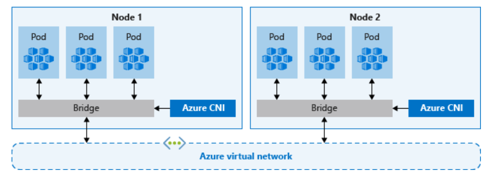

# Advanced AKS Networking Lab: CNI Overlay Analysis


## Training Overview
> **Estimated Duration:** 60 minutes  
> **Prerequisites:** 
> - Existing AKS cluster with Azure CNI Overlay networking (without Cilium datapath)
> - use cnioverlay-cilium.md instructions to create two clusters aks-cni-overlay and aks-cilium.  we will be using aks-cni-overlay cluster for this lab.
> - kubectl configured for cluster access
> - Azure CLI installed and authenticated
> - Basic knowledge of Kubernetes networking and load balancers
> **Learning Path:** Advanced Azure Kubernetes Service Networking

## Table of Contents
- [Exercise 1: CNI Overlay Network Analysis](#cni-overlay-network-analysis)
- [Exercise 2: Advanced Load Balancer Services](#advanced-load-balancer-services)
- [Exercise 3: Internal Load Balancer and Traffic Policy Analysis](#internal-load-balancer-analysis)
- [Exercise 4: Network Policy Implementation](#network-policy-implementation)
- [Exercise 5: Application Routing (Managed Ingress)](#create-a-cluster-with-application-routing)

## Key Learning Objectives
By the end of this lab module, you will be able to:
- Analyze Azure CNI Overlay networking behavior in existing clusters
- Configure advanced load balancer scenarios with traffic policies
- Implement and test external traffic policy configurations
- Deploy network policies for pod-to-pod communication control
- Understand source IP preservation and health check mechanisms
- Troubleshoot complex networking scenarios in production environments

## Prerequisites Validation
Before starting the lab exercises, verify your environment:

```bash
# Verify cluster access
kubectl get nodes -o wide

# Check cluster networking configuration
kubectl get configmap -n kube-system | grep azure

# Verify cluster is using CNI Overlay (check for azure-ip-masq-agent-config configmap)
# kubectl get configmap azure-ip-masq-agent-config-reconciled -n kube-system
kubectl describe configmap azure-ip-masq-agent-config -n kube-system

# For detailed configuration, view the configmap data:
kubectl get configmap azure-ip-masq-agent-config-reconciled -n kube-system -o yaml
```

**Understanding the IP Masquerading Configuration:**

The `azure-ip-masq-agent-config-reconciled` ConfigMap controls how traffic is masqueraded (SNAT'd) in your CNI Overlay cluster:

- **`MasqLinkLocal: true`**: Link-local addresses (169.254.0.0/16) are masqueraded when leaving the node. This ensures traffic to Azure metadata services appears to come from the node IP.

- **`NonMasqueradeCIDRs: - 10.244.0.0/16`**: Traffic within the pod CIDR range (10.244.0.0/16) is NOT masqueraded, preserving source IP addresses for pod-to-pod communication.

This configuration enables:
- Pod-to-pod communication with preserved source IPs
- Proper external connectivity through node IP masquerading  
- Correct routing to Azure services via link-local addresses

```bash

# Check for absence of Cilium (should show no Cilium pods)
kubectl get pods -n kube-system | grep cilium


```

## Connectivity Testing Setup
> 🔧 **Important:** This lab focuses on internal networking. For testing connectivity to internal load balancers, ensure you have:
> - Azure Bastion Host configured in your VNet, OR
> - A jump box VM in the same VNet/peered VNet, OR  
> - VPN/ExpressRoute connection to the AKS VNet
> 
> **Recommended:** Use Azure Bastion for secure, browser-based access to test VMs without requiring public IPs.

## Important Notes for Participants
> ⚠️ **Existing Cluster:** This lab assumes you have an existing AKS cluster with CNI Overlay networking without Cilium datapath  
> � **Network Policy Enforcement:** For network policies to work, your cluster must have either Azure Network Policy Manager (Azure NPM) or Calico installed. Without a policy engine, network policies will be ignored.  
> �📝 **Best Practice:** Monitor resource creation and cleanup applications when finished  
> 🔍 **Advanced Focus:** This lab covers advanced networking concepts suitable for production environments
## Exercise 1: CNI Overlay Network Analysis {#cni-overlay-network-analysis}

### Background and Context
Azure CNI Overlay is an advanced networking mode that provides better integration with Azure networking services while maintaining pod IP address conservation. In this exercise, you'll analyze the networking behavior of your existing CNI Overlay cluster.



### Key Concepts to Understand
- **CNI Overlay:** Advanced Container Network Interface with Azure integration
- **Pod IP Management:** Pods receive IPs from overlay network (not VNet address space)
- **Node Communication:** Direct VNet integration for nodes
- **Network Policies:** Support for Kubernetes network policies without Cilium datapath
- **Multi-Subnet Support:** Ability to span multiple subnets

### Learning Outcomes
Upon completion of this exercise, you will understand:
- How Azure CNI overlay operates in production environments
- Pod and node IP allocation strategies in overlay mode
- Network communication patterns between pods and external resources
- Advanced troubleshooting techniques for CNI overlay networking

### Step 1: Cluster Network Analysis

#### 1.1 Examine Current Network Configuration
```bash
# Get detailed node information
kubectl get nodes -o wide

# Examine cluster networking details
kubectl get pods -n kube-system -o wide | grep azure

# Check CNI configuration
kubectl describe configmap azure-ip-masq-agent-config -n kube-system

# View cluster network info
# kubectl cluster-info dump | grep -i "cluster-cidr\|service-cidr\|pod-cidr"
# use az command to check network info- check networkProfile
az aks show -n clname -g rgname   
```

#### 1.2 Deploy Test Workloads for Analysis
```bash
# Create test deployment across multiple nodes
kubectl create deployment network-test --image=nginx --replicas=4
```

# Create a debugging pod for network analysis

```bash  
cat <<EOF | kubectl apply -f -
apiVersion: v1
kind: Pod
metadata:
  name: netshoot
  labels:
    app: netshoot
spec:
  containers:
  - name: netshoot
    image: nicolaka/netshoot
    command: ["/bin/bash"]
    args: ["-c", "sleep 3600"]
EOF
```

#### 1.3 Analyze Pod Distribution and IP Allocation
```bash
# Check pod distribution across nodes
kubectl get pods -l app=network-test -o wide

# Examine pod IP ranges (should be overlay network)
kubectl get pods --all-namespaces -o wide | grep -v "HOST"

# Compare node IPs vs pod IPs
echo "=== NODE IPs ==="
kubectl get nodes -o jsonpath='{range .items[*]}{.metadata.name}{"\t"}{.status.addresses[?(@.type=="InternalIP")].address}{"\n"}{end}'

echo "=== POD IPs ==="
kubectl get pods -l app=network-test -o jsonpath='{range .items[*]}{.metadata.name}{"\t"}{.status.podIP}{"\n"}{end}'
```
You may see node IPs with kubectl get pods --all-namespaces -o wide      
Understand why

### Step 2: Network Connectivity Analysis

#### 2.1 Test Pod-to-Pod Communication
```bash
# Get pod IPs for testing
POD1_IP=$(kubectl get pod -l app=network-test -o jsonpath='{.items[0].status.podIP}')
POD2_IP=$(kubectl get pod -l app=network-test -o jsonpath='{.items[1].status.podIP}')

echo "Testing communication between pods:"
echo "Pod 1 IP: $POD1_IP"
echo "Pod 2 IP: $POD2_IP"

# Test connectivity from netshoot pod
kubectl exec netshoot -- ping -c 3 $POD1_IP
kubectl exec netshoot -- ping -c 3 $POD2_IP

# Test HTTP connectivity
kubectl exec netshoot -- curl -s http://$POD1_IP
kubectl exec netshoot -- curl -s http://$POD2_IP

```

#### 2.2 Analyze Network Routes and Interfaces
```bash
# Examine network interfaces in pods
kubectl exec netshoot -- ip addr show

# Check routing tables
kubectl exec netshoot -- ip route

# Compare with node networking (for contrast)
kubectl debug node/<node-name> -it --image=nicolaka/netshoot
# Then inside the debug pod:
ip addr show
ip route
exit
```

#### 2.3 DNS Resolution Testing
```bash
# Test internal DNS resolution
kubectl exec netshoot -- nslookup kubernetes.default.svc.cluster.local

# Test external DNS resolution
kubectl exec netshoot -- nslookup google.com

# Test service discovery
kubectl expose deployment network-test --port=80 --type=ClusterIP
kubectl exec netshoot -- nslookup network-test.default.svc.cluster.local

# Understand how service discovery is helpful with the command below  
kubectl exec netshoot -- curl -s http://network-test.default.svc.cluster.local
```

### Key Differences: CNI Overlay Behavior

| Feature | CNI Overlay (without Cilium) | Traditional CNI |
|---------|-------------------------------|-----------------|
| Pod IPs | Overlay network (192.168.x.x) | VNet subnet IPs |
| Network Policies | Basic kube-proxy based | Full Azure CNI support |
| Node Integration | Direct VNet connection | Direct VNet connection |
| IP Efficiency | Very High | Medium |
| Performance | Good (overlay overhead) | Best (direct) |
| Scalability | Excellent | Good |

## Exercise 2: Advanced Load Balancer Services {#advanced-load-balancer-services}

### Background and Context
Azure Load Balancer integration with AKS provides robust traffic distribution and high availability for your applications. This exercise focuses on internal load balancer configurations, demonstrating real-world patterns for application exposure within VNet environments.


### Key Concepts to Understand
- **Internal Load Balancer (ILB):** Routes traffic within the VNet and peered networks
- **Service Annotations:** Control Azure-specific load balancer behavior
- **Network Security Groups:** Control traffic flow to applications
- **Cross-Subnet Communication:** Understanding VNet-level connectivity
- **Bastion/Jump Box Access:** Secure methods for testing internal services

### Learning Outcomes
Upon completion of this exercise, you will understand:
- How to create and configure internal load balancer services
- Techniques for accessing applications from internal networks using Bastion/Jump Box
- Methods to create load balancers in specific subnets
- Advanced load balancer annotations and configurations
- How to test internal connectivity securely without public IPs

### Step 1: Application Deployment

#### 1.1 Create Base Application
```bash
# Deploy nginx application
kubectl create deployment nginxapp --image=nginx

# Verify deployment
kubectl get deployment nginxapp
kubectl get pods -l app=nginxapp
```

### Step 2: Internal Load Balancer Configuration

Review LB in MC resource groups before starting this exercise.  

#### 2.1 Create Internal Load Balancer Service

```bash
cat <<EOF | kubectl apply -f -
apiVersion: v1
kind: Service
metadata:
  name: nginxsvc
  annotations:
    service.beta.kubernetes.io/azure-load-balancer-internal: "true"
spec:
  type: LoadBalancer
  ports:
  - port: 80
  selector:
    app: nginxapp
EOF
```

#### 2.2 Verify Internal Load Balancer Creation
```bash
# Check service status
kubectl get svc nginxsvc

# Get detailed service information
kubectl describe svc nginxsvc
```

**Key Learning Point:** The internal load balancer IP comes from the same subnet as your AKS nodes.

#### 2.3 Test Internal Connectivity
**Using Azure Bastion (Recommended):**
```bash
# Get the service IP for testing
SERVICE_IP=$(kubectl get svc nginxsvc -o jsonpath='{.status.loadBalancer.ingress[0].ip}')
echo "Internal Load Balancer IP: $SERVICE_IP"

# Note: You'll need to access this IP from a VM connected via Azure Bastion or from a laptop/desktop that connect to IP from the subnet
# Example commands to run from Bastion-connected VM:
curl http://$SERVICE_IP
wget -qO- http://$SERVICE_IP
```

**Alternative Testing Methods:**
```bash
# Option 1: Test from another pod within the cluster - this is not really testing access via LB service you just created - FYI
kubectl exec netshoot -- curl -s http://$SERVICE_IP

# Option 2: Port-forward for local testing (limited to specific pods)  - this is not really testing access via LB service you just created - FYI
kubectl port-forward svc/nginxsvc 8080:80
# Then access via: http://localhost:8080
```

**Result:** The application should be accessible from within the VNet or through Bastion-connected resources.

### Step 3: Advanced Internal Load Balancer Scenarios

#### 3.1 Create Additional Internal Load Balancer for Comparison

```bash
# Create another internal load balancer for testing different configurations
cat <<EOF | kubectl apply -f -
apiVersion: v1
kind: Service
metadata:
  name: nginxsvc-secondary
  annotations:
    service.beta.kubernetes.io/azure-load-balancer-internal: "true"
spec:
  type: LoadBalancer
  ports:
  - port: 80
  selector:
    app: nginxapp
EOF
```

#### 3.2 Test Multi-Service Internal Connectivity
```bash
# Get both internal IPs for testing
INTERNAL_IP_1=$(kubectl get svc nginxsvc -o jsonpath='{.status.loadBalancer.ingress[0].ip}')
INTERNAL_IP_2=$(kubectl get svc nginxsvc-secondary -o jsonpath='{.status.loadBalancer.ingress[0].ip}')

echo "Primary Internal LB IP: $INTERNAL_IP_1"
echo "Secondary Internal LB IP: $INTERNAL_IP_2"

# Test both services from within cluster
kubectl run netshoot --image=nicolaka/netshoot --rm -it --restart=Never -- bash
# Inside the pod:
# curl http://$INTERNAL_IP_1
# curl http://$INTERNAL_IP_2
```

#### 3.3 Analyze Internal Load Balancer Configuration
Use the Azure Portal to examine:
1. The Standard Load Balancer created for your cluster (check Frontend IP configurations)
2. Backend pools pointing to your nodes (all should show private IPs)
3. Load balancing rules for your internal services
4. Health probes configuration for internal services
5. Network Security Group rules (should not require public internet access)

### Step 4: External Traffic Policy for Internal Load Balancers

#### 4.1 Understanding Traffic Policy for Internal Services

The `externalTrafficPolicy: Local` setting works for internal load balancers and optimizes traffic routing by:
- Preserving client source IP addresses from within the VNet
- Routing traffic only to nodes with healthy pods
- Reducing latency by avoiding extra network hops within the VNet
- Providing better load distribution control for internal clients

This is particularly important in production environments for:
- Application logging and monitoring (preserving internal client IPs)
- Security policies based on internal source IP addresses  
- Compliance requirements for internal audit trails
- Optimizing network performance within the VNet

## Exercise 3: Internal Load Balancer and Traffic Policy Analysis {#internal-load-balancer-analysis}

This exercise focuses on understanding internal load balancers and external traffic policies in a production AKS environment where applications are accessed through private networks.

### 3.1 Clean Environment and Deploy Test Application

Start with a clean environment for focused testing:
```bash
# Clean up any existing deployments and services
kubectl delete deployment --all
kubectl delete service --all

# Create a simple test application with a single replicas
kubectl create deployment test-app --image=nginx --replicas=1

# Wait for pods to be ready and check distribution
kubectl get pods -l app=test-app -o wide
```

### 3.2 Create Internal Load Balancer Service (Default Policy)

```bash
# Create internal load balancer service with default externalTrafficPolicy (Cluster)
cat <<EOF | kubectl apply -f -
apiVersion: v1
kind: Service
metadata:
  name: svc-cluster-policy
  annotations:
    service.beta.kubernetes.io/azure-load-balancer-internal: "true"
spec:
  type: LoadBalancer
  ports:
  - port: 80
  selector:
    app: test-app
EOF

# Wait for internal IP assignment
kubectl get svc svc-cluster-policy -w
```

### 3.3 Analyze Internal Load Balancer Configuration

> 📋 **Analysis Task:** Navigate to the Azure Portal and examine the MC_* resource group:
> 1. Locate the **Standard Load Balancer** for your cluster
> 2. Go to **Load balancing rules** → Find the rule for `svc-cluster-policy`
> 3. Examine:
>    - **Frontend IP configuration** (should show private IP from VNet)
>    - **Backend pool** (should show all cluster nodes)
>    - **Health probe** configuration
>    - **Port configuration**
> 4. Under 'Load balancing rules', Click **Health status** → **View details** to see backend instance states
> 5. Note that **all nodes appear in the backend pool** with internal IPs

### 3.4 Test Internal Load Balancer Connectivity

**Using Azure Bastion (Recommended):**
```bash
# Get the internal load balancer IP
INTERNAL_LB_IP=$(kubectl get svc svc-cluster-policy -o jsonpath='{.status.loadBalancer.ingress[0].ip}')
echo "Internal Load Balancer IP: $INTERNAL_LB_IP"

# Document this IP for Bastion testing
echo "Access this application via Azure Bastion-connected VM or network connected laptop : http://$INTERNAL_LB_IP"
```


### 3.5 Create Load Balancer Service with Local Traffic Policy

```bash
# Create internal load balancer service with externalTrafficPolicy: Local
cat <<EOF | kubectl apply -f -
apiVersion: v1
kind: Service
metadata:
  name: svc-local-policy
  annotations:
    service.beta.kubernetes.io/azure-load-balancer-internal: "true"
spec:
  type: LoadBalancer
  externalTrafficPolicy: Local
  ports:
  - port: 80
  selector:
    app: test-app
EOF
```
# Wait for internal IP assignment
```bash
kubectl get svc svc-local-policy -w
```


**Step 5: Analyze Local Traffic Policy Load Balancer Configuration**

> 📋 **Analysis Task:** Return to the Azure Portal and examine the changes:
> 1. Find the new **Load balancing rule** for `svc-local-policy`
> 2. Compare with the previous service:
>    - **Backend pool** (same nodes, but health probe behavior differs)
>    - **Health probe** (note the different port - this is the HealthCheck NodePort)
>    - **Health status** → **Load Balancing Rules --> View details** (some nodes may show as unhealthy)
> 3. **Key Observation #1:** Notice the **HealthCheck NodePort** in the service description
> 4. **Key Observation #2:** LB rule for the service with externalTrafficPolicy: Local  has some unhealthy instances

Use this following command to drain pods from all the nodes except one  or you can scale replicas for the deployment

for draining node use the following
```bash 
kubectl drain nnnnnn1-3 --ignore-daemonsets
```
for scaling replicas, use the following 
k scale deploy test-app --replicas=2
check Load Balancing Rules --> View details again (or click Refresh if already in same screen).   This should show only one node state up and others down
k scale deploy test-app --replicas=1

  

**Step 6: Investigate Health Check Mechanism**  -- OPTIONAL STEP
 
```bash
# Deploy troubleshooting pod for network analysis
kubectl run netshoot --image=nicolaka/netshoot --rm -it --restart=Never -- bash

# If the above doesn't work, deploy it as a regular pod
cat <<EOF | kubectl apply -f -
apiVersion: v1
kind: Pod
metadata:
  name: netshoot
spec:
  containers:
  - name: netshoot
    image: nicolaka/netshoot
    command: ["/bin/bash"]
    args: ["-c", "sleep 3600"]
EOF
```

**Step 7: Examine Health Check NodePorts**   -- OPTIONAL STEP   

```bash
# Get service details and extract health check information for svc-local-policy - notice the difference  
kubectl describe svc svc-cluster-policy
kubectl describe svc svc-local-policy

# Extract the HealthCheck NodePort (look for the high-numbered port)
HEALTH_CHECK_PORT=$(kubectl get svc svc-local-policy -o jsonpath='{.spec.healthCheckNodePort}')
echo "HealthCheck NodePort: $HEALTH_CHECK_PORT"

# Get node IPs for testing
kubectl get nodes -o wide

# Store node IPs in variables for easier testing
NODE1_IP=$(kubectl get nodes -o jsonpath='{.items[0].status.addresses[?(@.type=="InternalIP")].address}')
NODE2_IP=$(kubectl get nodes -o jsonpath='{.items[1].status.addresses[?(@.type=="InternalIP")].address}')

echo "Node 1 IP: $NODE1_IP"
echo "Node 2 IP: $NODE2_IP"
```

**Step 8: Test Health Check Endpoints**

```bash
# From the netshoot pod, test the health check endpoints
kubectl exec netshoot -- curl -s http://$NODE1_IP:$HEALTH_CHECK_PORT/healthz
kubectl exec netshoot -- curl -s http://$NODE2_IP:$HEALTH_CHECK_PORT/healthz

# The output should show something like:
# {
#   "service": {
#     "namespace": "default", 
#     "name": "svc-local-policy"
#   },
#   "localEndpoints": 2,
#   "serviceProxyHealthy": true
# }
```

**Expected Health Check Responses:**
- **Nodes with pods:** `"serviceProxyHealthy": true` and `"localEndpoints": > 0`
- **Nodes without pods:** `"serviceProxyHealthy": false` and `"localEndpoints": 0`

**Step 9: Deploy Source IP Test Application**

```bash
# Deploy an application that shows client source IP information
cat <<EOF | kubectl apply -f -
apiVersion: apps/v1
kind: Deployment
metadata:
  name: source-ip-test
spec:
  replicas: 3
  selector:
    matchLabels:
      app: source-ip-test
  template:
    metadata:
      labels:
        app: source-ip-test
    spec:
      containers:
      - name: source-ip-test
        image: registry.k8s.io/e2e-test-images/agnhost:2.43
        ports:
        - containerPort: 8080
        command:
        - /agnhost
        - netexec
        - --http-port=8080
        - --delay-shutdown=1
---
apiVersion: v1
kind: Service
metadata:
  name: source-ip-cluster-svc
  annotations:
    service.beta.kubernetes.io/azure-load-balancer-internal: "true"
spec:
  type: LoadBalancer
  ports:
  - port: 80
    targetPort: 8080
  selector:
    app: source-ip-test
---
apiVersion: v1
kind: Service
metadata:
  name: source-ip-local-svc
  annotations:
    service.beta.kubernetes.io/azure-load-balancer-internal: "true"
spec:
  type: LoadBalancer
  externalTrafficPolicy: Local
  ports:
  - port: 80
    targetPort: 8080
  selector:
    app: source-ip-test
EOF

# Wait for services to get external IPs
kubectl get svc source-ip-cluster-svc source-ip-local-svc -w
```

### 3.6 Test Source IP Preservation with Internal Load Balancers

```bash
# Get service IPs for testing
SVC_CLUSTER_IP=$(kubectl get svc source-ip-cluster-svc -o jsonpath='{.status.loadBalancer.ingress[0].ip}')
SVC_LOCAL_IP=$(kubectl get svc source-ip-local-svc -o jsonpath='{.status.loadBalancer.ingress[0].ip}')

echo "Cluster Policy Service IP: $SVC_CLUSTER_IP"
echo "Local Policy Service IP: $SVC_LOCAL_IP"

# Test from netshoot pod - this will show the actual client IP
echo "=== Testing Cluster Policy (may show SNAT'd IP) ==="
kubectl exec netshoot -- curl -s $SVC_CLUSTER_IP/clientip

echo ""
echo "=== Testing Local Policy (should preserve source IP) ==="
kubectl exec netshoot -- curl -s $SVC_LOCAL_IP/clientip

# Get the netshoot pod IP for comparison
NETSHOOT_IP=$(kubectl get pod netshoot -o jsonpath='{.status.podIP}')
echo ""
echo "Netshoot Pod IP for reference: $NETSHOOT_IP"
```

**Expected Results:**
- **Cluster Policy:** May show a different IP (SNAT'd by kube-proxy or node)
- **Local Policy:** Should show the actual netshoot pod IP (preserved)

### 3.7 Test from Azure Bastion for Real Client IP Analysis

**Connecting via Azure Bastion:**
1. Set up Azure Bastion in your VNet (if not already configured)
2. Connect to a VM in the same VNet through Bastion
3. From the Bastion-connected VM, test the services:

```bash
# Commands to run from your Bastion-connected VM
# Get the VM's internal IP for reference
VM_INTERNAL_IP=$(hostname -I | awk '{print $1}')
echo "VM Internal IP: $VM_INTERNAL_IP"

# Test both services (replace with actual service IPs)
echo "=== Testing Cluster Policy from Bastion-connected VM ==="
curl -s http://<cluster-policy-service-ip>/clientip

echo ""
echo "=== Testing Local Policy from Bastion-connected VM ==="
curl -s http://<local-policy-service-ip>/clientip
```


**Bastion Test Expected Results:**
- **Cluster Policy:** May show the node IP instead of the VM IP
- **Local Policy:** Should show the actual VM internal IP (from Bastion session)

### 3.8 Monitor Load Balancer Health Status

In the Azure Portal, monitor the load balancer health status changes as you:
1. Scale pods up and down
2. Cordon/uncordon nodes  
3. Apply different external traffic policies

**Real-time Monitoring Commands:**
```bash
# Watch service status changes
kubectl get svc -w

# Monitor pod distribution changes
kubectl get pods -o wide -w

# Check health probe status via kubectl
kubectl get events --field-selector type=Warning
```

This real-time observation helps understand production load balancer behavior in internal-only networking scenarios.


**Congratulations on completing the AKS Networking Lab Module!** 🎉


